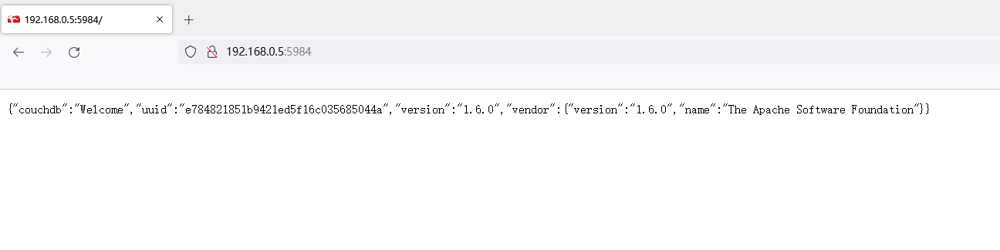
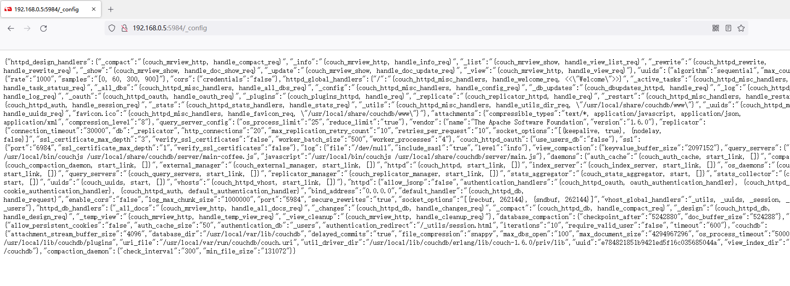

# CouchDB Unauthorized Access Vulnerability

## Description

Due to improper configuration, CouchDB is vulnerable to unauthorized access and malicious exploitation.

Attackers can access internal data without authentication, which may result in the leakage of sensitive information and the malicious clearing of all data by hackers.

## Vulnerability Deployment

> https://github.com/vulhub/vulhub/blob/master/couchdb/CVE-2017-12636/README.zh-cn.md

Start using docker-compose.

```bash
cd couchdb/CVE-2017-12636/
docker-compose up -d
```


## Exploitation

Visit the 5984 port to see the version information.



Visit the `/_config` interface to see the CouchDB configuration information.



