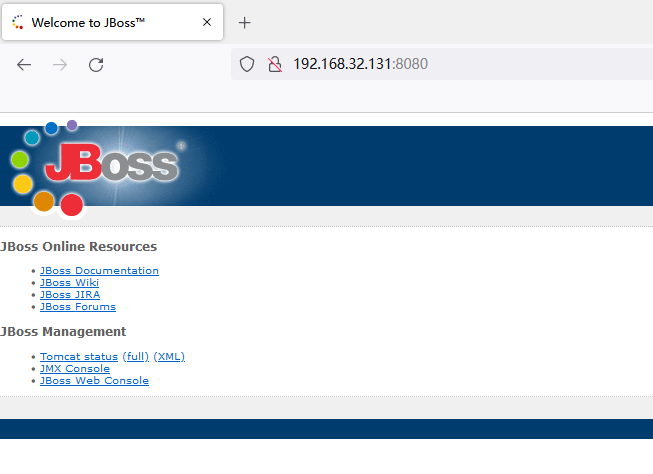
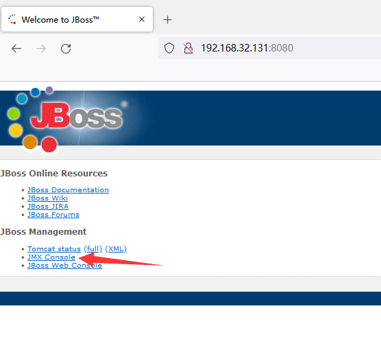
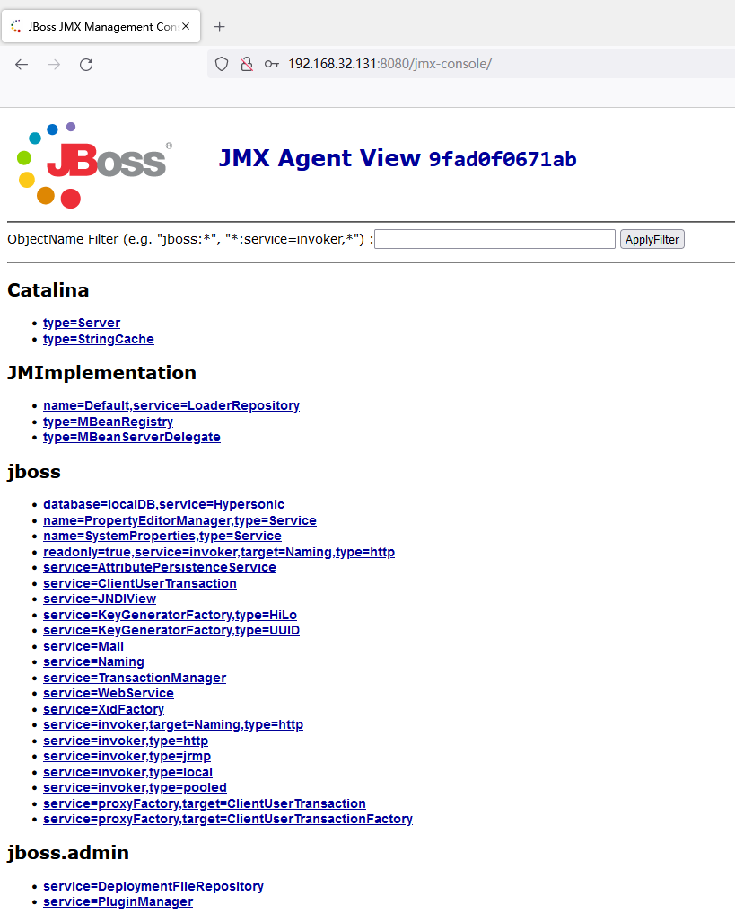
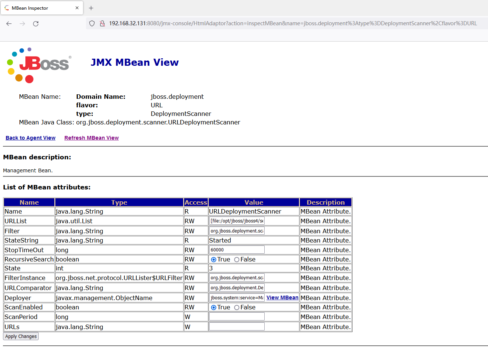
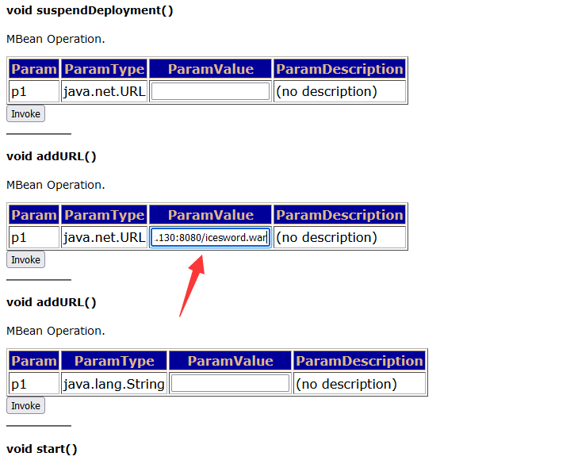
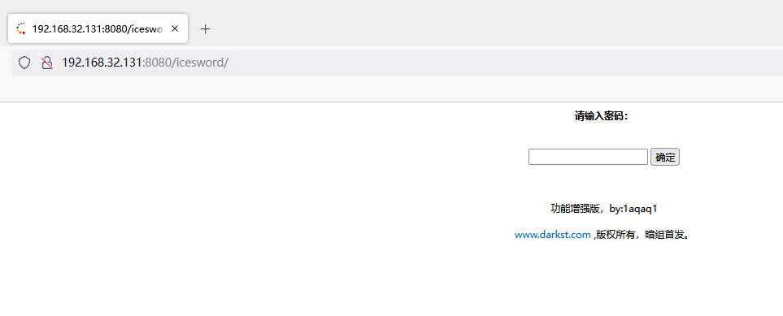

# Unauthorized Access Vulnerability in JBoss

## Vulnerability Description

JBoss is a container and server for managing EJBs that supports the EJB 1.1, EJB 2.0, and EJB3 specifications. However, the JBoss core service does not include a WEB container that supports [servlet](https://so.csdn.net/so/search?q=servlet&spm=1001.2101.3001.7020)/JSP, and is generally bound with Tomcat or Jetty. JBoss listens on port 8080 by default.

In older versions of JBoss, the JBoss Web console ([http://IP:8080/jmx-console](http://ip:8080/jmx-console)) is accessible by default, without a username or password. Through the vulnerability of unauthorized access to the JBoss management console, the background service can be managed and system commands can be executed by script commands such as bouncing shells, wget writing Webshell files.

## Environment Setup

Use the vulnerability environment of CVE-2017-7504, start the environment:

```
[root@localhost CVE-2017-7504]# docker-compose up
```

Access port **8080** in the browser



## Vulnerability Reproduction

Find the default JBoss page and click to enter the control page



Assuming it's an unauthorized access, clicking on `JMX-Console` will not prompt for a username and password. This is a different vulnerability environment and the username and password are both admin, admin, so pretend that no username and password are needed.



Find `jboss.deployment` and enter the application deployment page



After entering the application deployment page, scroll down to find `void addURL()`. Fill in the address of the Trojan on the remote server in the `ParamValue` section.



Access the `iceword` path to see the webshell



