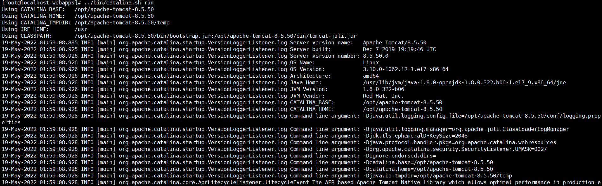
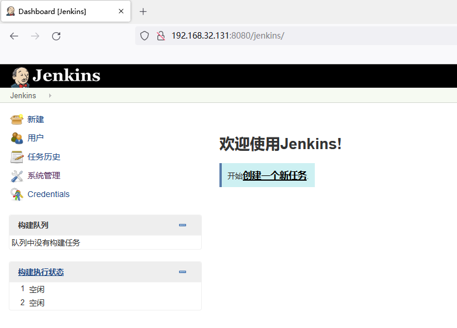
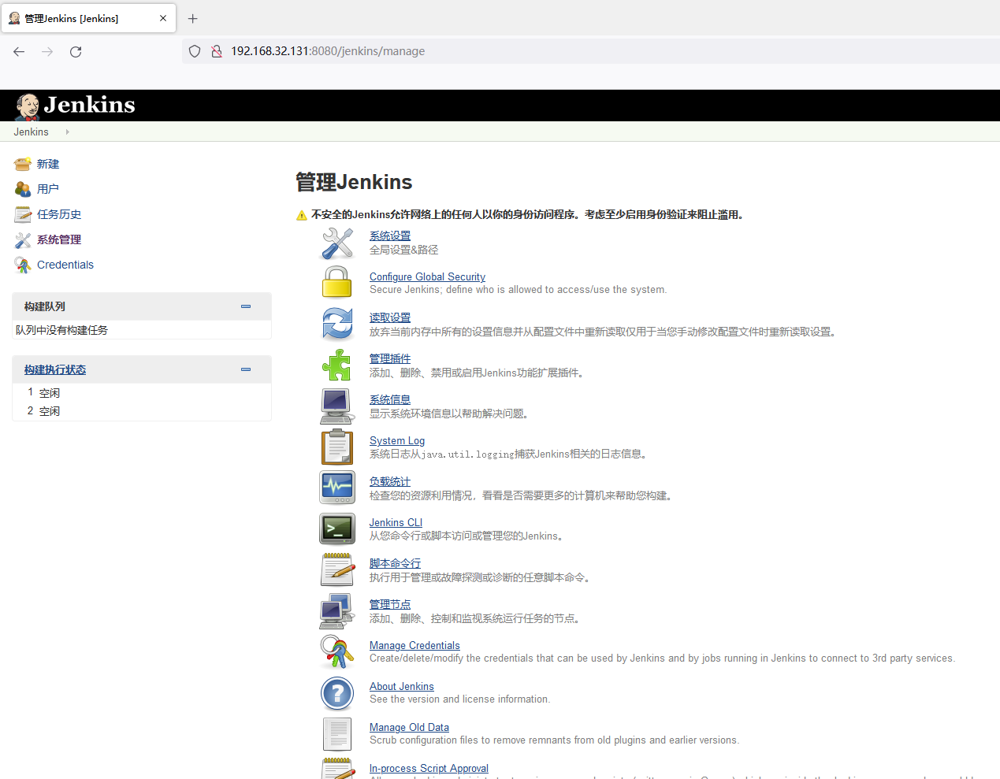
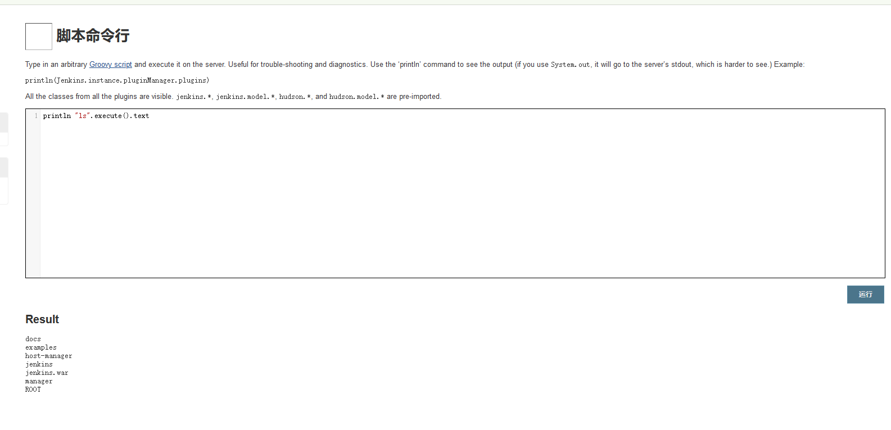

# Jenkins Unauthorized Access Vulnerability

## Vulnerability Description

Deploying **Jenkins version 1.62** with a global authorization policy open, the latest version of Jenkins now requires user login by default, but the default configuration of old versions is "any user can do anything", leading to unauthorized access issues.

## Environment Setup

Download version 1.62 from http://archives.jenkins-ci.org/war-stable/1.625.1/jenkins.war

Place the WAR package in the tomcat webapps folder and start tomcat.

## Vulnerability Reproduction

Enter the management page: http://192.168.32.131:8080/jenkins/manage

Enter the script command line, and type in "script" as the suffix to enter the script command line, then input `println "ls".execute().text` to execute the `ls` command.

