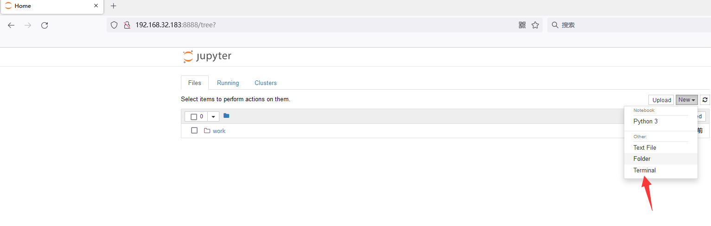
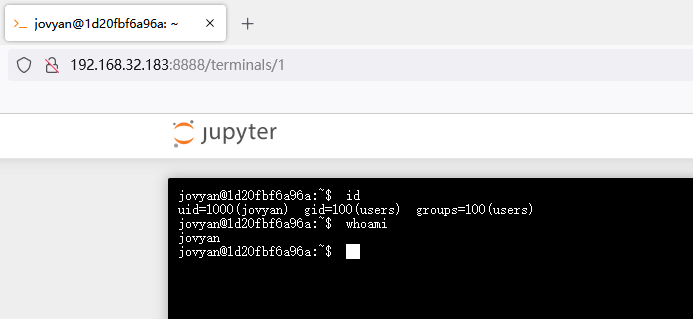

# Jupyter Notebook Unauthorized Access Vulnerability

## Vulnerability Description

Jupyter Notebook (formerly known as IPython notebook) is an interactive notebook that supports over 40 programming languages.

If the administrator does not configure a password for Jupyter Notebook, it will result in an unauthorized access vulnerability, allowing visitors to create a console and execute arbitrary Python code and commands.

## Environment Setup

```
version: '2'
services:
 web:
   image: vulhub/jupyter-notebook:5.2.2
   command: start-notebook.sh --NotebookApp.token=''
   ports:
    - "8888:8888"
```

After running, access `http://your-ip:8888` to see the Jupyter Notebook web management interface without having to enter a password.

## Vulnerability Reproduction

Select "new" -> "terminal" to create a console:



Execute any command directly:




