# SpringBoot Actuator Unauthorized Access Vulnerability

## Introduction

Spring Boot Actuator is a module in Spring Boot project that provides a set of endpoints for monitoring and managing Spring Boot applications. These endpoints can be used to retrieve the application's running status, view application statistics, view configuration information in the application, etc.

Additionally, security operations can also be performed using Actuator, such as shutting down the application. Using Actuator makes it easier to monitor, manage and maintain Spring Boot applications.

Here are some of its endpoints:

| Http |      Path       |                         Description                          |
| :--: | :-------------: | :----------------------------------------------------------: |
| get  |   /autoconfig   | Provides an auto-config report recording which auto-config conditions passed and which failed |
| get  |  /configprops   | Describes configuration properties (including default values) and how they are injected into Beans |
| get  |     /beans      | Describes all Beans in the application context and their relationships |
| get  |      /dump      |              Gets a snapshot of active threads               |
| get  |      /env       |               Gets all environment properties                |
| get  |   /env/{name}   |   Gets a specific environment property value based on name   |
| get  |     /health     | Reports on application health metrics, which are provided by implementations of HealthIndicator |
| get  |      /info      | Gets custom application information, which is provided by properties starting with "info" |
| get  |    /mappings    | Describes all URI paths and their relationships to controllers (including Actuator endpoints) |
| get  |    /metrics     | Reports various application metric information, such as memory usage and HTTP request count |
| get  | /metrics/{name} | Reports the application metric value for the specified name  |
| post |    /shutdown    | Shuts down the application with endpoints.shutdown.enabled set to true (default is false) |
| get  |     /trace      | Provides basic HTTP request trace information (timestamps, HTTP headers, etc.) |
| get  |    /heapdump    |             Gets a heap dump of the running JVM              |


## 环境搭建

> Spring Boot Actuator unauthenticated access vulnerability comes in 1.x and 2.x versions.

### srpingboot 2.x

Download demo code

```
git clone https://github.com/callicoder/spring-boot-actuator-demo.git
```

Build project code into jar package using maven.

```
mvn package
```

Start Spring Boot application

```
java -jar target/actuator-demo-0.0.1-SNAPSHOT.jar
```

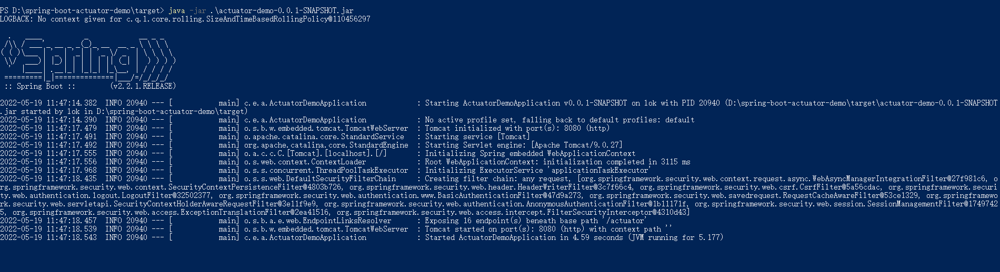

Access in browser: [http://localhost:8080](http://localhost:8080/).

### srpingboot 1.x

Create a new maven project in IDEA. Modify `pom.xml` to declare a parent dependency relationship indicating that the project depends on the `spring-boot-starter-parent` project of Spring Boot, with version 1.4.6.RELEASE. 

```
    <parent>
        <groupId>org.springframework.boot</groupId>
        <artifactId>spring-boot-starter-parent</artifactId>
        <version>1.4.6.RELEASE</version>
    </parent>

    <!-- Add typical dependencies for a web application -->
    <dependencies>

        <dependency>
            <groupId>org.springframework.boot</groupId>
            <artifactId>spring-boot-starter-web</artifactId>
        </dependency>

        <dependency>
            <groupId>org.springframework.boot</groupId>
            <artifactId>spring-boot-starter-actuator</artifactId>
        </dependency>
    </dependencies>

    <build>
        <plugins>
            <plugin>
                <groupId>org.springframework.boot</groupId>
                <artifactId>spring-boot-maven-plugin</artifactId>
            </plugin>
        </plugins>
    </build>
```

Add a test file: `\src\main\java\Example.java`

```
import org.springframework.boot.*;
import org.springframework.boot.autoconfigure.*;
import org.springframework.stereotype.*;
import org.springframework.web.bind.annotation.*;

@RestController
@EnableAutoConfiguration
public class Example {

    @RequestMapping("/")
    String home() {
        return "Hello World!";
    }

    public static void main(String[] args) throws Exception {
        SpringApplication.run(Example.class, args);
    }

}
```

Modify `application.properties`.

```
endpoints.beans.enabled=true
spring.redis.password=123456
```

## Vulnerability Reproduction

### Spring Boot 2.x 

Access the `/info` interface to leak spring boot project information.

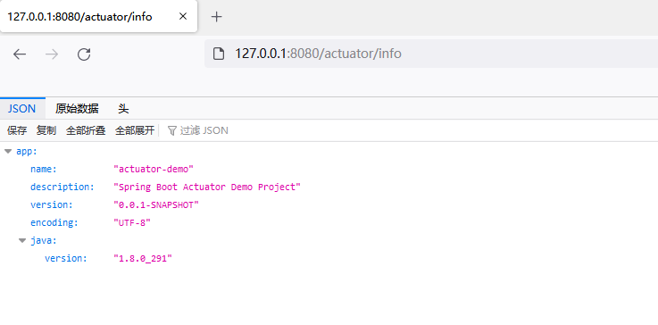

Access the `/env` interface to leak spring boot environment variable information.

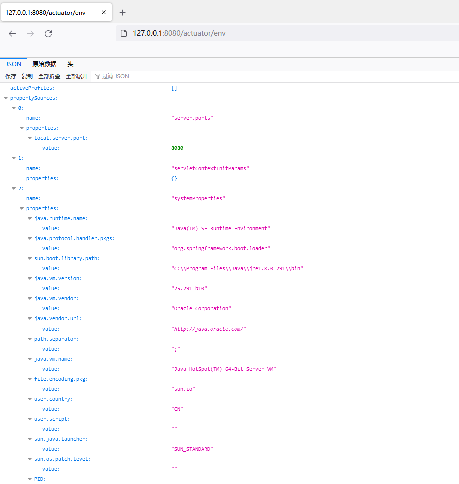


### springboot 1.x

Access the `/metrics` interface to display application information.

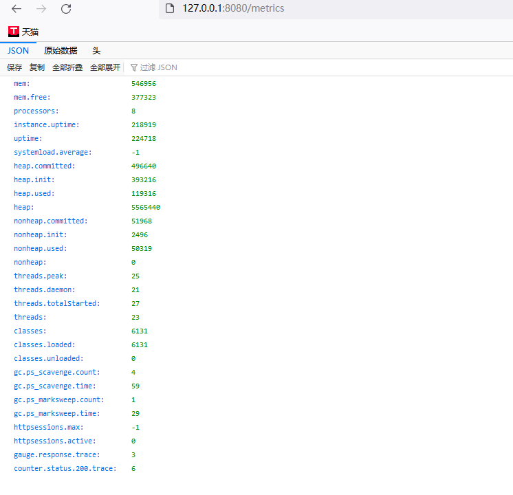

Access the `/trace` interface to display detailed information about the visiting data packets. 

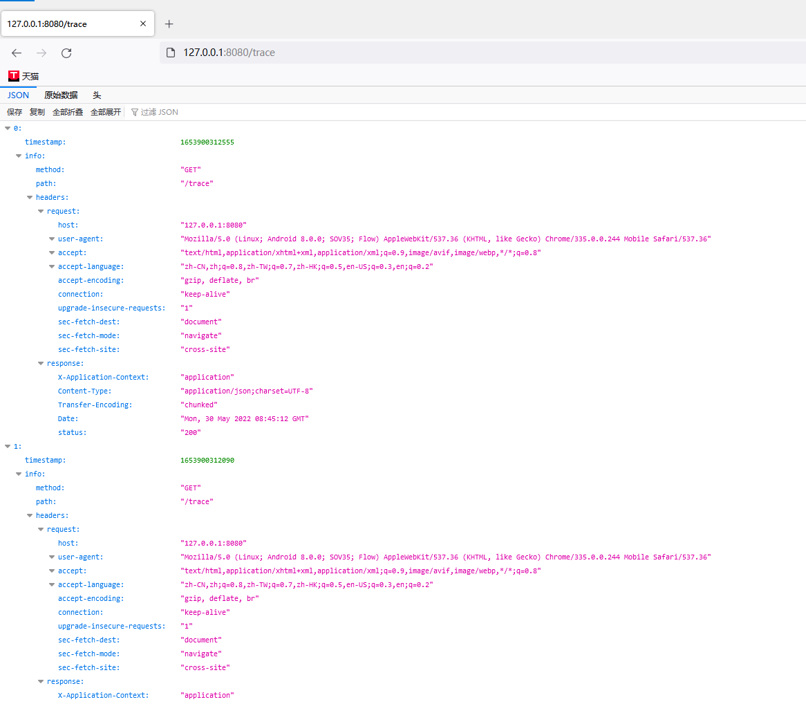


## Heapdump Leakage Reading

The heap dump feature of Spring Boot Actuator, if not properly configured, can be a security vulnerability. It allows heap dumps of the running JVM to be obtained via URL, which may contain sensitive information.

Access the `/heapdump` interface to download the heap dump file.

### Jvisualvm Analysis

JVisualVM is a Java visualization and monitoring tool provided by Oracle. It is included in the Oracle JDK distribution and can be used to monitor and configure Java applications, diagnose performance issues, and check memory usage and heap dumps.

JVisualVM provides a variety of features, including:

- Monitoring JVM performance, memory usage, and threads
- Configuring CPU and memory usage of Java applications
- Heap dump analysis and memory leak detection
- JMX console for checking and managing MBeans

Open `jvisualvm.exe`.

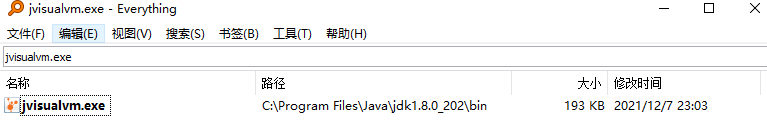

Loading Heapdump File

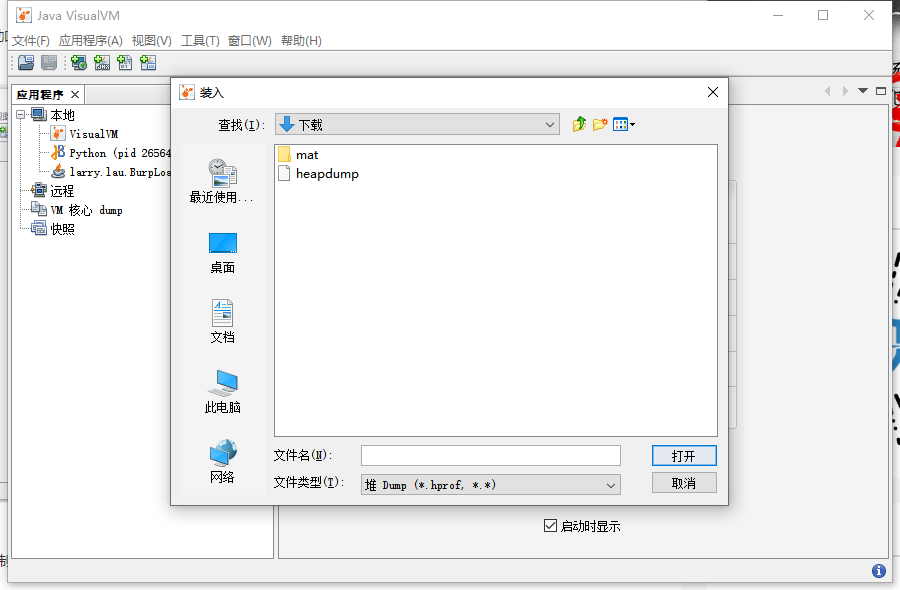

In the tool menu bar, click the plugin and install the OQL plugin.

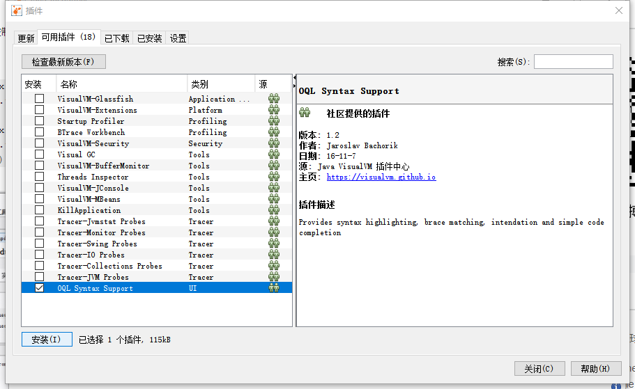

Construct the OQL statement to perform keyword search and obtain plaintext passwords.

Spring Boot 1.x Version Query Statements

```
select s.value.toString() from java.util.Hashtable$Entry s where /password/.test(s.key.toString())
```

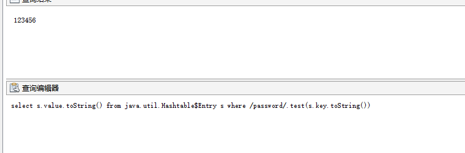

Spring Boot 2.x Version Query Statements

```
select s.value.toString() from java.util.LinkedHashMap$Entry s where /password/.test(s.key.toString())
```

### jhat

JHat is a Java heap analysis tool. It can be used to analyze Java heap dump files to identify memory leaks and other memory problems. It provides a web interface that allows users to browse objects in the heap dump, examine reference relationships, inspect memory usage, etc.

Using the jhat command to analyze the heapdump file will start a 7000 port web page.

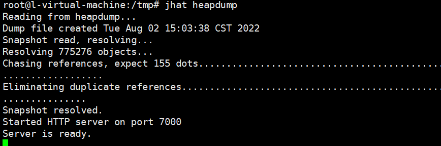

Accessing port 7000 requires **manual keyword search.**

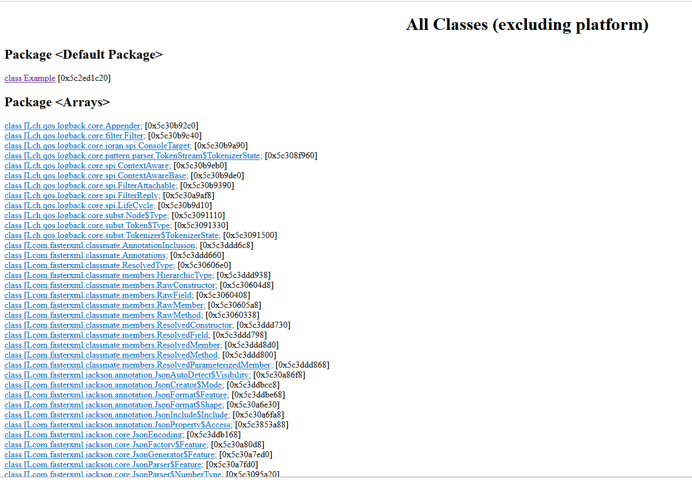

### **heapdump_tool** 

Essentially based on jhat, heapdump sensitive information search is achieved by parsing heapdump files through jhat.

> 下载链接：https://toolaffix.oss-cn-beijing.aliyuncs.com/heapdump_tool.jar

```
java -jar heapdump_tool.jar  heapdump
```

Select 1 to obtain all contents and then input keywords.

> Query Method:
>
> 1. Keyword, for example: password
> 2. Character length: len=10, to get all key or value values with length 10.
> 3. Get by order: num=1-100, to get characters 1-100 in order. Get url, file, ip geturl, to get all urls in the strings. getfile, to get all file paths and names in the strings. getip, to get all IPs in the strings. By default, data that is not in the key-value format is not displayed in the query results. To display all values, input all=true, and to cancel all=false.

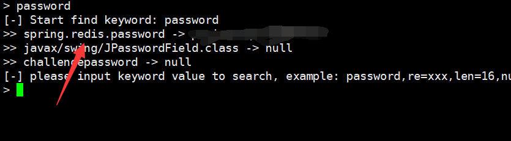


### mat

A heap dump is a memory snapshot of a Java process at a certain point in time. The Eclipse Memory Analyzer tool can be used to analyze leaked heap dump files and query for plaintext password information loaded into memory. The standalone version can be downloaded from http://www.eclipse.org/mat/downloads.php.

> The latest version uses Java 11, and older versions can be downloaded.

In spring boot 1.x, the final results of the heap dump query are stored in the key-value pairs of the `java.util.Hashtable$Entry` instance.

```
select * from org.springframework.web.context.support.StandardServletEnvironment
select * from java.util.Hashtable$Entry x WHERE (toString(x.key).contains("password"))
```

In spring boot 2.x, the final results of the heap dump query are stored in the key-value pairs of the `java.util.LinkedHashMap$Entry` instance.

```
select * from java.util.LinkedHashMap$Entry x WHERE (toString(x.key).contains("password"))
```

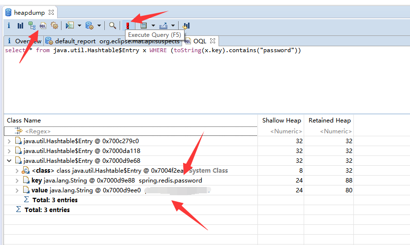

## Recommendations for fixing

### Spring Boot 2.x Fix

#### Disable interface

In the `application.properties` configuration file, change to `management.endpoint.beans.enabled=false`.

```
management.endpoint.beans.enabled=false
```

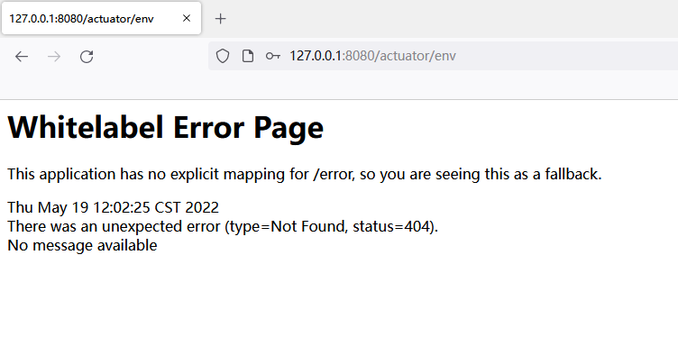

##### Authenticate actuator interface

`application.properties`

```
# Spring Security default user name and password
spring.security.user.name=actuator
spring.security.user.password=actuator
spring.security.user.roles=ACTUATOR_ADMIN
```

If access to the actuator interface is needed, custom code can be used and security can be referenced for authentication access.

`\src\main\java\com\example\actuatordemo\config\ActuatorSecurityConfig.java`

```
package com.example.actuatordemo.config;

import org.springframework.boot.actuate.autoconfigure.security.servlet.EndpointRequest;
import org.springframework.boot.actuate.context.ShutdownEndpoint;
import org.springframework.boot.autoconfigure.security.servlet.PathRequest;
import org.springframework.context.annotation.Configuration;
import org.springframework.security.config.annotation.web.builders.HttpSecurity;
import org.springframework.security.config.annotation.web.configuration.WebSecurityConfigurerAdapter;

@Configuration
public class ActuatorSecurityConfig extends WebSecurityConfigurerAdapter {

    /*
        This spring security configuration does the following

        1. Restrict access to the Shutdown endpoint to the ACTUATOR_ADMIN role.
        2. Allow access to all other actuator endpoints.
        3. Allow access to static resources.
        4. Allow access to the home page (/).
        5. All other requests need to be authenticated.
        5. Enable http basic authentication to make the configuration complete.
           You are free to use any other form of authentication.
     */

    @Override
    protected void configure(HttpSecurity http) throws Exception {
        http
                .authorizeRequests()
                //注释掉可以对actuator路径进行鉴权
//                    .requestMatchers(EndpointRequest.to(ShutdownEndpoint.class))
//                        .hasRole("ACTUATOR_ADMIN")
//                    .requestMatchers(EndpointRequest.toAnyEndpoint())
//                        .permitAll()
                    .requestMatchers(PathRequest.toStaticResources().atCommonLocations())
                        .permitAll()
                    .antMatchers("/", "/slowApi")
                        .permitAll()
                    .antMatchers("/**")
                        .authenticated()
                .and()
                .httpBasic();
    }
}
```

> This is a security configuration for spring boot actuator endpoints. It extends WebSecurityConfigurerAdapter and overrides the `configure` method to define the security policy for the application.
>
> The policy defined in this configuration does the following:
>
> 1. Restrict access to the Shutdown endpoint to the ACTUATOR_ADMIN role.
> 2. Allow access to all other actuator endpoints.
> 3. Allow access to static resources.
> 4. Allow access to the home page (/).
> 5. All other requests need to be authenticated.
> 6. Enable HTTP basic authentication to complete the configuration.

`\src\main\java\com\example\actuatordemo\controller\SampleController.java`

```
package com.example.actuatordemo.controller;

import org.springframework.web.bind.annotation.GetMapping;
import org.springframework.web.bind.annotation.RequestParam;
import org.springframework.web.bind.annotation.RestController;

import java.util.Random;
import java.util.concurrent.TimeUnit;

@RestController
public class SampleController {

    @GetMapping("/")
    public String sayHello(@RequestParam(value = "name", defaultValue = "Guest") String name) {
        return "Hello " + name + "!!";
    }

    @GetMapping("/slowApi")
    public String timeConsumingAPI(@RequestParam(value = "delay", defaultValue = "0") Integer delay) throws InterruptedException {
        if(delay == 0) {
            Random random = new Random();
            delay = random.nextInt(10);
        }

        TimeUnit.SECONDS.sleep(delay);
        return "Result";
    }

}
```

> This is a simple REST controller with 2 endpoints:
>
> 1. `/`: A GET endpoint that returns "Hello {name}!!" where name is a query parameter with a default value of "Guest".
> 2. `/slowApi`: A GET endpoint that returns "Result" after sleeping for a random or specified amount of time in seconds. The delay is specified as a query parameter with a default value of 0.

`\src\main\java\com\example\actuatordemo\health\CustomHealthIndicator.java`

```
package com.example.actuatordemo.health;

import org.springframework.boot.actuate.health.AbstractHealthIndicator;
import org.springframework.boot.actuate.health.Health;
import org.springframework.stereotype.Component;

@Component
public class CustomHealthIndicator extends AbstractHealthIndicator {

    @Override
    protected void doHealthCheck(Health.Builder builder) throws Exception {
        // Use the builder to build the health status details that should be reported.
        // If you throw an exception, the status will be DOWN with the exception message.

        builder.up()
                .withDetail("app", "Alive and Kicking")
                .withDetail("error", "Nothing! I'm good.");
    }
}
```

> This is a custom health indicator for Spring Boot Actuator. It extends the `AbstractHealthIndicator` class and overrides the `doHealthCheck` method. The `doHealthCheck` method uses the `Health.Builder` object to build the health status details that should be reported.
>
> In this implementation, the health status is set to UP, with details indicating the application is "Alive and Kicking" and there is "Nothing! I'm good."

Accessing actuator requires password input upon starting the service.

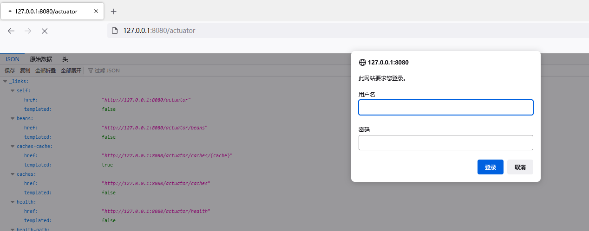

### Spring Boot 1.x Repair Solution

##### Disable Interface

```
# Close all interfaces
endpoints.enabled = false

### Enable only certain interfaces
#endpoints.beans.enabled = true
#endpoints.env.enabled = true
#endpoints.trace.enabled = true
#endpoints.metrics.enabled = true
```

##### Authentication

You can also introduce the `spring-boot-starter-security` dependency

```
　　　　　<dependency>
            <groupId>org.springframework.boot</groupId>
            <artifactId>spring-boot-starter-security</artifactId>
        </dependency>
```

In the `application.properties`, specify the actuator port and enable security functionality. Configure access permission verification. When accessing the actuator function, a login window will pop up, and you need to enter a username and password to verify before access is allowed.

```
management.security.enabled=true
security.user.name=admin
security.user.password=admin
```