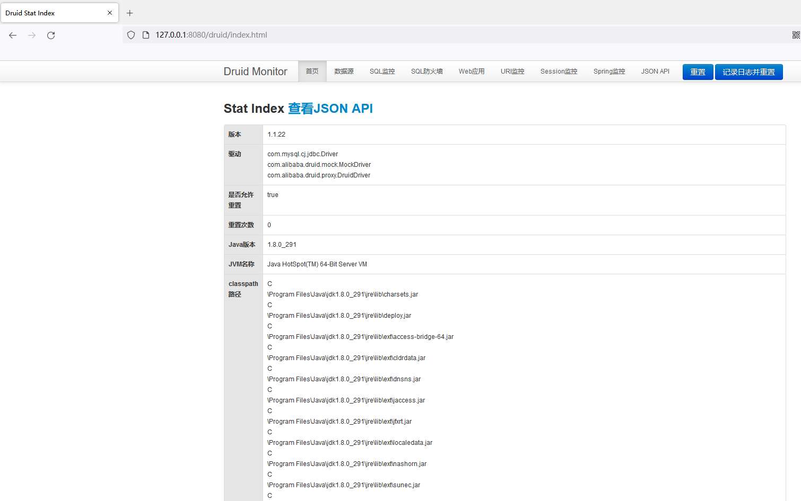
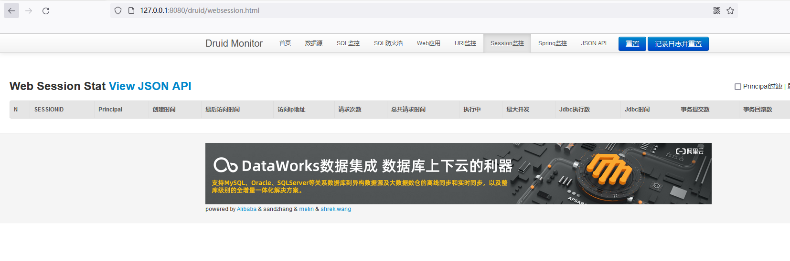
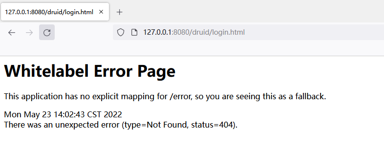
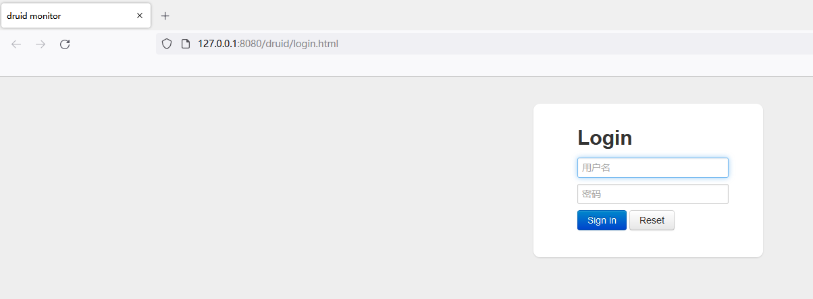
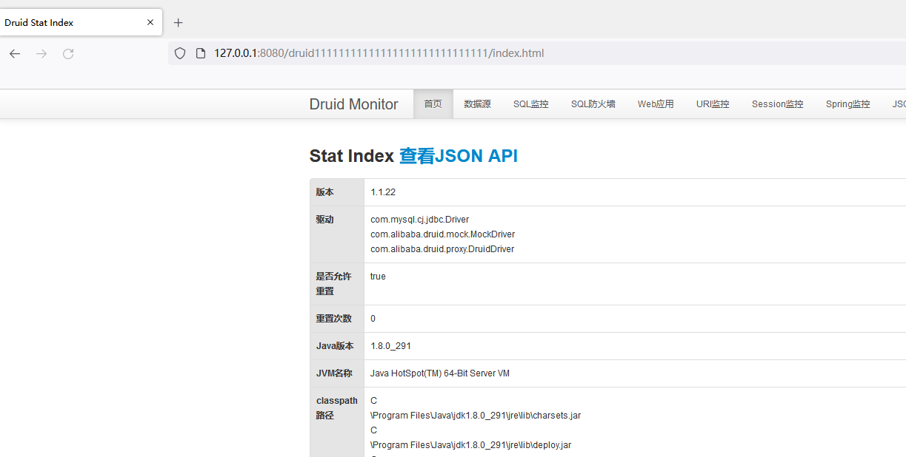

# Unauthorized Access Vulnerability in Druid Monitoring Page

## Vulnerability Introduction

Druid is a database connection pool produced by Alibaba Database, and its monitoring function provided by Druid monitors the execution time of SQL, the request of Web URI, and Session monitoring. First of all, Druid does not have any vulnerabilities. However, when the developer misconfigures, it may cause unauthorized access.

## Environment Setup

pom.xml Configuration

```
<?xml version="1.0" encoding="UTF-8"?>
<project xmlns="http://maven.apache.org/POM/4.0.0" xmlns:xsi="http://www.w3.org/2001/XMLSchema-instance"
         xsi:schemaLocation="http://maven.apache.org/POM/4.0.0 https://maven.apache.org/xsd/maven-4.0.0.xsd">
    <modelVersion>4.0.0</modelVersion>
    <parent>
        <groupId>org.springframework.boot</groupId>
        <artifactId>spring-boot-starter-parent</artifactId>
        <version>2.6.3</version>
        <relativePath/> <!-- lookup parent from repository -->
    </parent>
    <groupId>com.example</groupId>
    <artifactId>demo</artifactId>
    <version>0.0.1-SNAPSHOT</version>
    <name>demo</name>
    <description>Demo project for Spring Boot</description>
    <properties>
        <java.version>1.8</java.version>
    </properties>
    <dependencies>
        <dependency>
            <groupId>org.springframework.boot</groupId>
            <artifactId>spring-boot-starter-jdbc</artifactId>
        </dependency>
        <dependency>
            <groupId>org.springframework.boot</groupId>
            <artifactId>spring-boot-starter-web</artifactId>
        </dependency>
        <dependency>
            <groupId>org.mybatis.spring.boot</groupId>
            <artifactId>mybatis-spring-boot-starter</artifactId>
            <version>2.2.2</version>
        </dependency>

        <dependency>
            <groupId>mysql</groupId>
            <artifactId>mysql-connector-java</artifactId>
            <scope>runtime</scope>
        </dependency>
        <dependency>
            <groupId>org.springframework.boot</groupId>
            <artifactId>spring-boot-starter-test</artifactId>
            <scope>test</scope>
        </dependency>
        <dependency>
            <groupId>com.alibaba</groupId>
            <artifactId>druid-spring-boot-starter</artifactId>
            <version>1.1.1</version>
        </dependency>
    </dependencies>

    <build>
        <plugins>
            <plugin>
                <groupId>org.springframework.boot</groupId>
                <artifactId>spring-boot-maven-plugin</artifactId>
            </plugin>
            <plugin>
                <groupId>org.apache.maven.plugins</groupId>
                <artifactId>maven-resources-plugin</artifactId>
                <version>3.1.0</version>
            </plugin>
        </plugins>
    </build>

</project>

```

Configuration of `application.properties`

```
# Database connection
spring.datasource.type=com.alibaba.druid.pool.DruidDataSource
spring.datasource.url=jdbc:mysql://127.0.0.1:3306/t1?serverTimezone=Asia/Shanghai
spring.datasource.username=sec
spring.datasource.password=sec123

## Enable StatFilter
spring.datasource.druid.web-stat-filter.enabled=true

# Enable the built-in monitoring page
spring.datasource.druid.stat-view-servlet.enabled=true
```


## Vulnerability Reproduction

Directly access `druid/index.html`.



You can log in as a forged user through the session function.



## Fix

### Disable druid

`application.properties` configuration

```
spring.datasource.druid.stat-view-servlet.enabled=false
spring.datasource.druid.web-stat-filter.enabled=false
```



### Set authentication

```
# Set the login username
spring.datasource.druid.stat-view-servlet.login-username=admin
# Set the login password
spring.datasource.druid.stat-view-servlet.login-password=123
```



### Modify the path

```
##The address of the built-in monitoring page
spring.datasource.druid.stat-view-servlet.url-pattern=/druid11111111111111111111111111111/*
```

