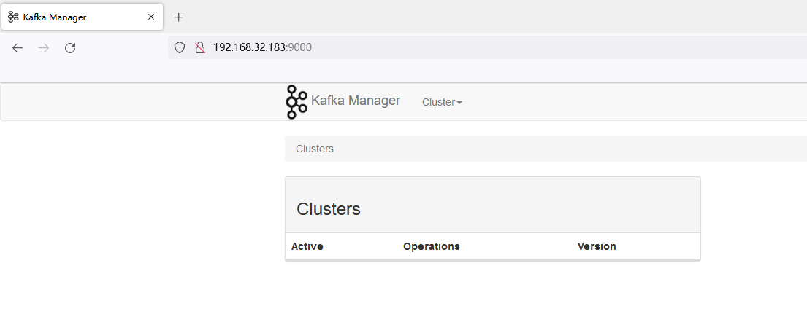

# Unauthorized Access Vulnerability in Kafka Manager

## Vulnerability Description

Kafka Manager is a tool for managing and monitoring Apache Kafka clusters. If Kafka Manager is not properly configured and exposed to the internet, attackers may be able to access it without authorization and obtain sensitive information such as the configuration and usage of the Kafka cluster.

Additionally, if an attacker has sufficient permissions, they can also manipulate the Kafka cluster, such as creating topics and modifying configurations, posing a threat to the system.

## Environment Setup

zookeeper

```
docker run -d  -p 2181:2181 -e TZ="Asia/Shanghai" wurstmeister/zookeeper:latest
```

kafka-manager

```
docker run -d -p 9000:9000 -e ZK_HOSTS=192.168.32.183:2181 sheepkiller/kafka-manager:latest
```

## Vulnerability Exploitation

Access port 9000 to access the Kafka management interface without authorization.



View cluster information.

