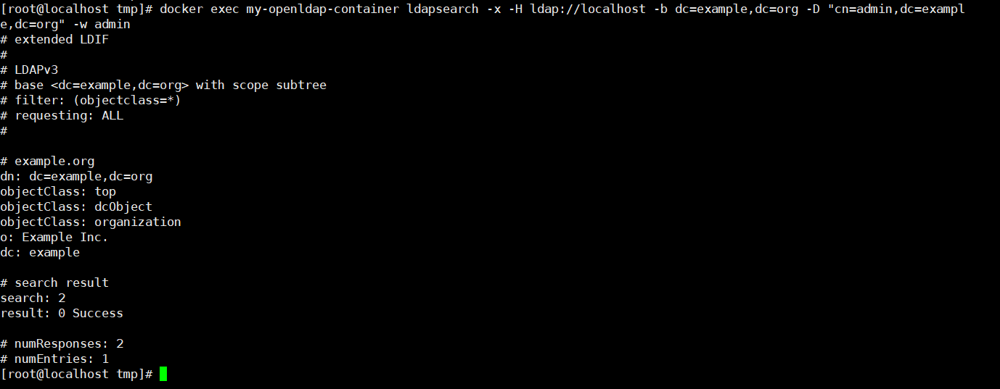

# Unauthorized Access Vulnerability in LDAP

## Introduction

LDAP stands for Lightweight Directory Access Protocol, based on the X.500 standard and supports TCP/IP.

LDAP directory is a database and the LDAP server (equivalent to DBMS) handles queries and updates. Data is stored in a tree-like hierarchical structure and is optimized for reading performance compared to relational databases. LDAP is suitable for information with fewer changes and cross-platform.

**LDAP Attributes**

|  Attribute  |     Full Name      |                         Description                          |
| :---------: | :----------------: | :----------------------------------------------------------: |
|     dn      | distinguished name | A unique identifier, similar to an absolute path. Each object has a unique identifier. For example: uid=tester,ou=People,dc=example,dc=com |
|     rdn     |      relative      | A relative identifier, similar to a relative path. For example: uid=tester |
|     uid     |      user id       | Usually refers to the user login name. For example: uid=tester |
|     sn      |      sur name      | Usually refers to a person's last name. For example: sn: Su  |
|  giveName   |                    | Usually refers to a person's first name. For example: giveName: Aldwin |
|      I      |                    | Usually refers to the name of a place. For example: I: Beijing |
| objectClass |                    | objectClass is a special attribute that contains the storage method and related attribute information. |
|     dc      |  domain component  | Usually refers to a domain name. For example: dc=example,dc=com |
|     ou      | organization unit  | Usually refers to the name of an organizational unit. For example: ou=people,dc=example,dc=com |
|     cn      |    common name     | Usually refers to an object's name. If it's a person, the full name is required. |
|      c      |      country       | A two-letter country code. For example: CN, US, HK, JP, etc. |

## Environment Setup

```
docker run -p 389:389 -p 636:636 --name my-openldap-container --detach osixia/openldap:1.5.0
```

## Vulnerability Reproduction

```
docker exec my-openldap-container ldapsearch -x -H ldap://localhost -b dc=example,dc=org -D "cn=admin,dc=example,dc=org" -w admin
```

