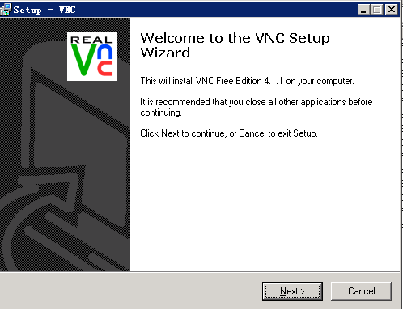
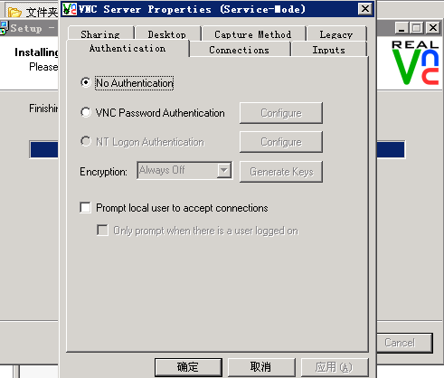
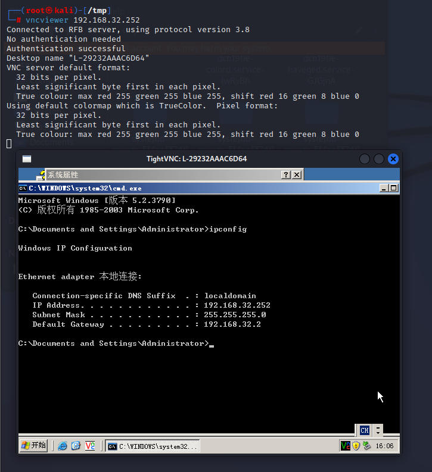

# Unauthorized Access Vulnerability in VNC Server

> CVE-2006-2369

## Vulnerability Description

RealVNC VNC Server is a VNC server software for remote access by UK company RealVNC.

There is an authorization issue vulnerability in RealVNC VNC Server, which stems from the adoption of the RFB (Remote Frame Buffer) protocol that allows the client and server to negotiate the appropriate authentication method. There is a design error in the implementation of the protocol, and a remote attacker can access the server without a password by bypassing authentication.

## Scope of Impact

RealVNC <= 4.1.1

### Environment Setup

> win2003 system

Download address: https://www.filesoul.com/software/RealVNC/4-1-1/download/

Install (just keep clicking next)





## Vulnerability Exploitation

```
vncviewer 192.168.32.252
```



### Defense Measures

- Configure VNC client login password authentication and configure a password that meets password strength requirements.
- Run the operating system with the minimum common privilege.
