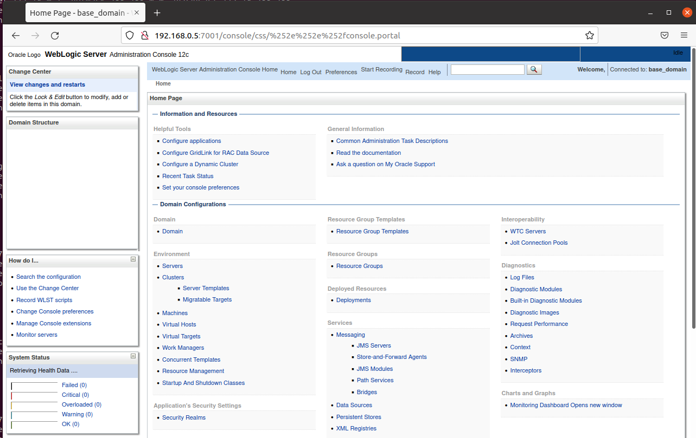

# Unauthorized Access Vulnerability in Weblogic

## Vulnerability Description

Weblogic is a J2EE application server introduced by Oracle Corporation. The CVE-2020-14882 allows unauthorised users to bypass the permission verification of the management console and access the backend, while the CVE-2020-14883 allows the backend arbitrary user to execute any command through the HTTP protocol. The exploitation chain consisting of these two vulnerabilities enables an unauthorised any user to execute commands on a remote Weblogic server by means of a GET request.

## Vulnerability Detection

Using vulhub to build the vulnerability demonstration environment.

```bash
cd vulhub/weblogic/CVE-2020-14882
sudo docker-compose up -d
```

```
http://192.168.0.5:7001/console/css/%252e%252e%252fconsole.portal
```

The attacker can construct a URL of a special request to access the management backend page without authorization:



Remote attackers can construct a special HTTP request to take over the WebLogic Server Console without authentication, and execute arbitrary code in the WebLogic Server Console.
