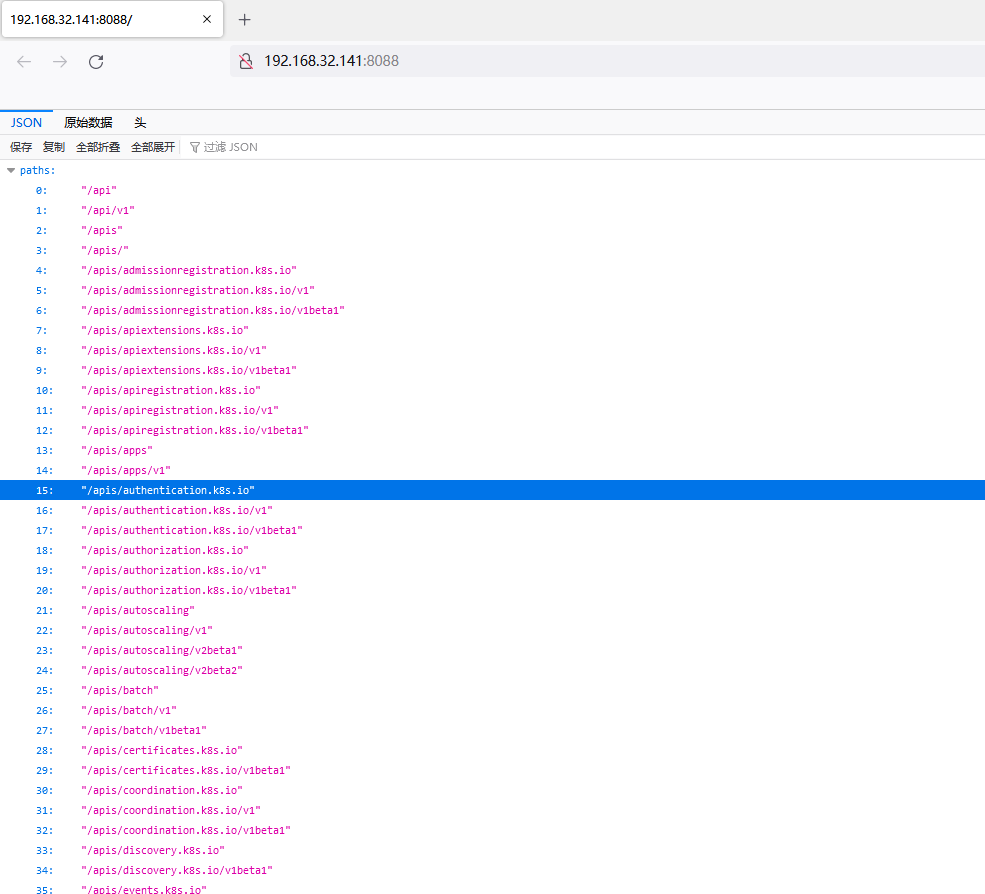
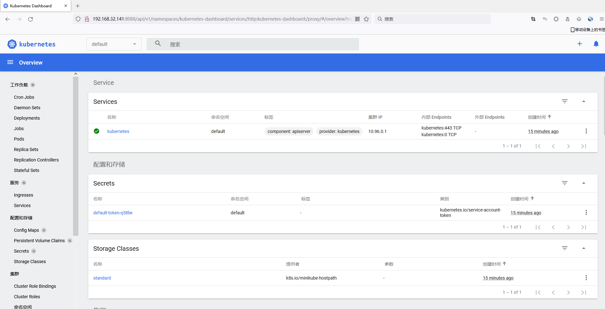

# Unauthorized Access to Kubernetes API Server

## Vulnerability Description

When Kubernetes service is normally started, two ports will be opened: Localhost Port (default 8080), Secure Port (default 6443). Both of these ports provide API Server services, one can be directly accessed through the web, and the other can be called through the kubectl client. If the operation and maintenance personnel do not have reasonable configuration validation and permissions, then the attacker can obtain the rights to the container through these two interfaces.

## Environment Setup

> ubuntu 18.04

Download

```
wget https://github.com/kubernetes/minikube/releases/download/v1.18.1/minikube-linux-amd64
mv minikube-linux-amd64 minikube
chmod 777 minikube

wget "https://storage.googleapis.com/kubernetes-release/release/v1.18.3/bin/linux/amd64/kubectl" -O "/usr/local/bin/kubectl"
chmod 755 /usr/local/bin/kubectl

```

Start K8S

```
sudo sysctl -w net/netfilter/nf_conntrack_max=131072
./minikube start --kubernetes-version=v1.18.3 --force --driver=docker  --extra-config=apiserver.anonymous-auth=true
```

Start dashboard

```
root@l-virtual-machine:/opt# ./minikube dashboard
* Enabling dashboard ...
  - Using image kubernetesui/dashboard:v2.1.0
  - Using image kubernetesui/metrics-scraper:v1.0.4
* Verifying dashboard health ...
* Launching proxy ...
* Verifying proxy health ...
http://127.0.0.1:35293/api/v1/namespaces/kubernetes-dashboard/services/http:kubernetes-dashboard:/proxy/
```

Map K8S API out

```
root@l-virtual-machine:/opt# kubectl proxy  --port=8088 --address='0.0.0.0' --accept-hosts='^.*'
Starting to serve on [::]:8088
```



## Vulnerability Detection

Dashboard

```
http://192.168.32.141:8088/api/v1/namespaces/kubernetes-dashboard/services/http:kubernetes-dashboard:/proxy/#/overview?namespace=default
```




## Vulnerability Fix

- Authorize and authenticate;
- Use Service Account tokens;
- Set firewall policies to limit IP access to the service.